<h1 align="center"><b>明慧专题：“天安门自焚”真相</b></h1>
<a href="http://118.161.48.86/classic/">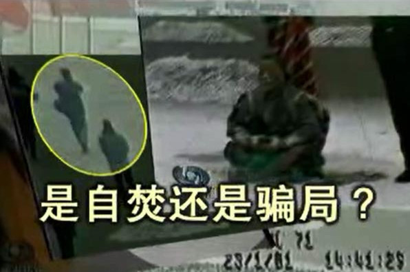</a>

2001年1月23日（除夕）下午，天安门广场“突发”5 人自焚事件。 事发仅 2 小时，新华社以超乎寻常的速度向全世界发出英语新闻，声称“自焚者是五名法轮功学员”。但是，美国之音记者打电话向北京公安局和公安部查证，答复竟然是不知道有这回事。喉舌的宣传口径竟然抢到了公安调查的前面！

如此迫不及待，已经暴露了这并非突发事件，而是一场准备充分的阴谋——假如真是突发事件，是根本来不及准备的。

当局的准备不仅仅是这些，央视紧跟着推出了攻击法轮功的“自焚新闻”、“焦点访谈”，而且强制全国各界、各企事业单位观看，反复“学习”。然而事与愿违的是， 反复播放的录像却暴露了越来越多的破绽，显出这是一场骗局。

<h1><b>法轮功明确指出：</b></h1>
<h2><b>炼功人不能杀生，自杀有罪</b></h2>
法轮修炼大法是由李洪志先生创编的佛家上乘修炼大法。在李洪志大师的著作《转法轮》中明确指出：“炼功人不能杀生”，李洪志先生还在 《悉尼法会讲法》中指出：“自杀是有罪的。” 真正的法轮功学员不会去自焚。

<b>自焚伪案疑点：</b> 
<b>女主角被当场灭口？</b>

<a href="https://github.com/mbzxdj/san/blob/master/download/jxgs.mp4?raw=true">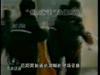</a>
<h1 align="center"><b><a href="https://github.com/mbzxdj/san/blob/master/download/jxgs.mp4?raw=true">录像：追查国际“天安门自焚疑案”调查纪实</a></b></h1>

“追查迫害法轮功国际组织”成立于二零零三年一月，是以追查取证和国际起诉迫害法轮功相关人员为重点的独立常设国际机构。本组织的使命是：追查迫害法轮功的一切罪行以及相关的机构、组织和个人。无论天涯海角，无论时日长短，必将追查到底；行天理，再现公道，匡扶人间正义。

2001年1月23日下午2点41分，北京天安门广场发生了震惊中外的“自焚”事件，中国官方新华社和中央电视台第一时间迅速报道，指称参与”自焚”的五人和两名“自焚未遂者”为法轮功学员。法轮功学员否认了指控，并指出“自焚”行为严重违反法轮功的原则和教导。一些国际媒体和第三方国际机构也提出质疑。美国<华盛顿邮报>记者的实地采访证实，“自焚”者并非法轮功学员，而国际教育发展组织所提供的“自焚”现场录像分析更指出，中国政府涉嫌一手策划导演了这场“天安门自焚”事件。事实真相究竟如何？

鉴于此案性质严重，影响巨大，本组织在得到有关“自焚”疑案的多方举报后，特于2003年1月23日成立“天安门自焚事件调查委员会”，对此案进行了多方位深入详细的取证调查。

[大字片头]“天安门自焚”疑案调查纪实

（一）对王进东和刘葆荣的语音鉴定

在“天安门自焚”事件中，有个多次出场的重要人物：王进东。我们来看看这位被中国政府称为“自焚”事件的组织者王进东。

[“自焚”录像中王进东的镜头，央电视台的三集《焦点访谈》节目中的王进东]

这就是王进东。我们接到多起举报指证，在“自焚”现场的王进东与《焦点访谈》节目中的王进东不是同一个人。

追查迫害法轮功国际组织根据举报，对王进东进行了多角度的追查取证。首先我们委托世界先进的中文语音识别实验室对前后出场的王进东作了语音鉴定。音像资料取中国自央电视台的《焦点访谈》节目。

台湾大学语音实验室在中文语音的辨识、合成、检索、验证、及口语对话等方面拥有相当丰富而先进的技术，曾率先完成全世界第一台能相当正确辨识任意文句的中文语音的电脑。

[采访台大语音实验室语音鉴定专家]
承追查国际所委托，对于王进东的语音鉴定，我们采取了先进的“语者验证（Speaker Verification）”技术，将常用于语者验证高斯混合模型（Gaussian Mixture Model，GMM）用于对王进东等前后出现的语音进行比较鉴定，……

[语者验证结果报告分析，图表，仪器显示等。专家叙述]
从这些语者验证结果报告中，可以得出十分确定的结论：积水潭医院中被烧伤（或第一集中被烧伤）的王进东与其他两集《焦点访谈》节目中的王进东不是同一个人。

台大语音实验室：语者验证结果报告。

[王进东前后出场镜头特写，定格，大字字幕]
两个“王进东”！

[王进东“自焚”现场打坐镜头，旁白]
此鉴定结果与本组织通过其他渠道对王进东真实身份的追查结果相吻合。追查国际从可靠途径查获：参与“自焚”的“王进东”是由一名现役军人扮演。

（二）对刘思影的死因调查
“自焚”事件中，有一个叫刘思影的小女孩被严重烧伤。

事发后，刘思影和其他几位伤者被送往据称是北京治疗烧伤最好的积水潭医院。追查国际对积水潭医院参与治疗刘思影的医务人员进行了调查。

经过详细调查，我们从积水潭医院参与治疗刘思影的医务人员处得到惊人消息：

“刘思影在烧伤基本治疗得差不多了，身体已基本恢复正常，已打算出院的时候突然死亡，死因可疑。”

刘思影死前一段时间，包括死亡前一天，3月16日，周末休息前的星期五，心肌酶谱和其他各项检查均正常。然而3月17日，星期六的中午11-12点左右医生突然发现刘思影已处于病危状态，并很快死亡。另3月17日上午8-9点钟时，积水潭医院负责人和北京市医政处处长曾到刘思影病房探视，与刘思影说了很多话。

谁谋杀了刘思影！？

（三）失踪的两个多小时

[“自焚”现场录像，部分原声报道]

据新华社2001年1月30日对自焚事件的报导称，1月23日14时41分，在人民英雄纪念碑的东北侧，王进东首先点燃火焰，“不到一分钟，几名民警连用４个灭火器，迅速扑灭了这名男子身上的火焰，并用值勤警务车将其迅速送往医院救治。”几分钟后，人民英雄纪念碑北面，４名相距不远的女子点燃了身上的汽油。仅过了一分半钟，火焰均被扑灭。“事件发生后不到７分钟，北京急救中心的三辆急救车也及时赶到现场，将伤者紧急送往北京治疗烧伤最好的积水潭医院。”

从新华社报导的“自焚”开始的时间下午2点41分加上7分钟的灭火、送上救护车的时间和从天安门广场到积水潭医院20多分钟的正常车程（对急救车行驶应短于此时间），这些“自焚”人员应该在下午3点多被送到积水潭医院。

根据调查，积水潭医院多位工作人员确认，“自焚”者至少在晚上5点以后才被送到积水潭医院。那么，从下午3点左右到晚上5点左右，中间至少有两个小时以上的时间，新华社的报导无法解释这些人去了哪里？原本20多分钟的车程为什么花了急救车两个多小时？

在这失踪的两个多小时里到底发生了什么？

（四）对刘春玲的死因调查

[刘春玲被击打镜头]
从中央电视台《焦点访谈》节目中关于自焚的现场录像可以看到，有一名身穿大衣的男子手持一重物，用力向死者刘春玲的头部击打，导致刘春玲急速倒地，并用手护卫被打的左侧头部。追查国际有理由认为刘春玲极有可能是在现场被打死，而非被烧死。现场这一名身穿军大衣的男子很明显不是在参与救人，而是要置刘春玲于死地！

[定格穿军大衣的男子]
这个人是谁？他为什么要谋杀刘春玲？

根据以上的调查结果和证据，本组织确认“天安门自焚”事件是中共建政以来的一桩极大的阴谋，涉及恶性谋杀和栽赃陷害。该案牵扯的各方关系复杂，犯罪元凶可能直接涉及到中国原国家主席、原党总书记和当时和现在都是军委主席的江泽民。追查国际将继续深入地追查此案，公布事实真相，并将调查结果报告相关国际机构和各国司法及人权机构，进行法律起诉，直至将所有犯罪者和阴谋策划者绳之于法。

策划“天安门自焚事件”的嫌犯和主谋

身穿军大衣、拿重物击打刘春玲的凶犯

谋杀了刘思影的嫌犯

追查迫害法轮功国际组织
“天安门自焚”事件调查委员会

2003年5月2日
<h1 align="center"><b>◎天安门警察背着灭火器巡逻？</b></h1>
<table border="0" cellspacing="3" cellpadding="3">
<tbody>
<tr>
<td align="center"></td>
</tr>
<tr>
<td align="center">澳洲《时代报》（The Age）2004年10月16日的报道对央视的自焚录像做出强烈质疑：“警方事先不知情，却在90秒内，携带大量消防设备出现在画面中。”</td>
</tr>
</tbody>
</table>

<h1 align="center"><b>◎衣服烧烂，头发却耐火？</b></h1>

<table border="0" cellspacing="3" cellpadding="3">
<tbody>
<tr>
<td align="center">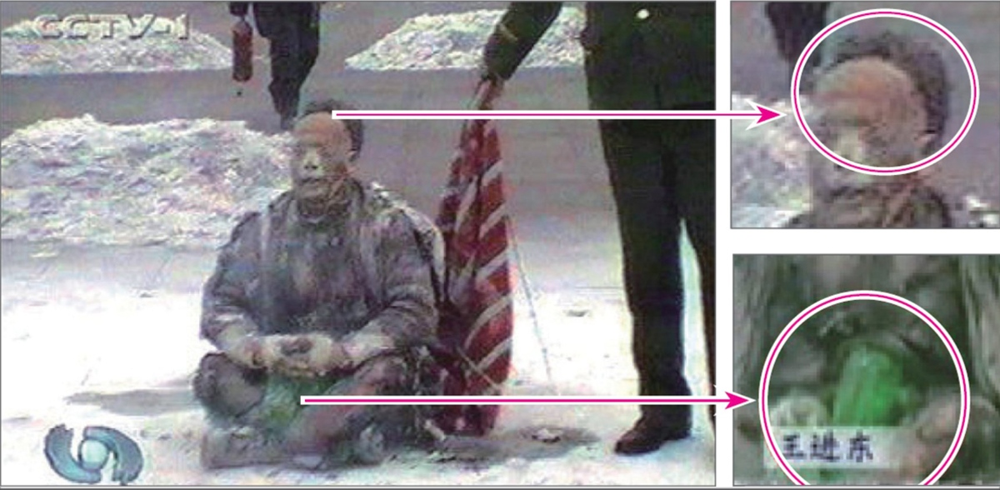</td>
</tr>
<tr>
<td align="center">警察晃着灭火毯等镜头，棉衣裤子烧烂，头发还完好，火烧后盛着汽油的塑料瓶完好翠绿。央视女记者承认自焚“摆拍”。</td>
</tr>
</tbody>
</table>

<h1 align="center"><b>◎谁是画面外的摄影师？</b></h1>

<table border="0" cellspacing="3" cellpadding="3">
<tbody>
<tr>
<td align="center">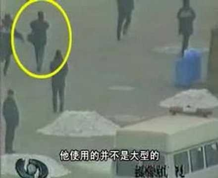</td>
</tr>
<tr>
<td align="center">图中的男子在军警间从容拍摄。国际社会质疑：央视自焚录像有远景、移动拍摄的近景，还有多个自焚者在不同位置的特写，并且录下了声音，显然摄影师做好了准备才能做到的专业拍摄。</td>
</tr>
</tbody>
</table>

<h1 align="center"><b>◎自焚的王进东是法轮功学员吗？</b></h1>
<table border="0" cellspacing="3" cellpadding="3">
<tbody>
<tr>
<td align="center"></td>
</tr>
<tr>
<td align="center">自称“老学员”的王进东竟然不会双盘腿。</td>
</tr>
</tbody>
</table>

<table border="0" cellspacing="3" cellpadding="3">
<tbody>
<tr>
<td align="center"></td>
</tr>
<tr>
<td align="center">王进东的大拇指不是法轮功的正确动作——指尖轻轻接触，而是错误的上下重叠。</td>
</tr>
</tbody>
</table>

<h1 align="center"><b>国际教育发展组织：该事件是由政府一手导演的</b></h1>
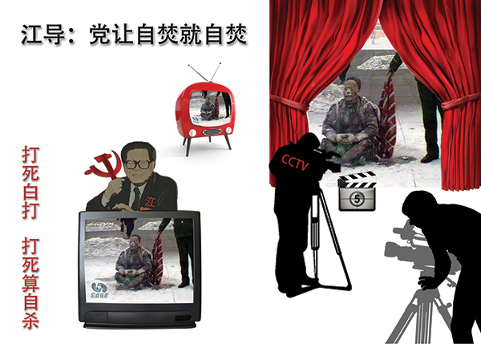

<b>2001年8月14日，在联合国倡导和保护人权附属委员会第53届会议上，天安门自焚案被当场揭穿。国际教育发展组织（IED）发言说：“我们的调查表明，真正残害生命的恰恰是中共当局……我们得到了一份该事件（天安门自焚案）的录像片，并从中得出结论，该事件是由这个政府一手导演的。”面对确凿证据，中共代表团哑口无言，没有辩辞。该声明已被联合国备案。 </b>

<h1 align="center"><b>联合国会议大厅里，正义的声音再次响起</b></h1>

文/法轮功学员日内瓦报导

【明慧网2001年8月18日】继八月三日发言谴责中共当局对法轮功的迫害及人权侵犯之后(见明慧八月十四日报导)，国际教育发展组织(International Educational Development, IED)八月十四日在联合国倡导和保护人权附属委员会(The United Nations Sub-Commission on the Promotion and Protection of Human Rights)第53届会议第六项议程中再次发言，强烈谴责中共当局的“国家恐怖主义行为”。

IED八月十四日的声明中说：“政府对人民施行的国家恐怖行为所导致的严重人权迫害远远超过任何其他形式的恐怖主义行动。当一个政权施行国家恐怖行为时，国际社会就将面临大量人权侵犯案例和难民而不知所措的困境。中国对法轮功修炼者的残暴迫害就是这样的例子。”

“我们在八月三日的发言中描述了我们对法轮功的观察了解。中国政府代表在随后的答复中企图以诬陷法轮功残害生命破坏家庭来为其国家恐怖行为辩护。我们的调查表明，真正残害生命的恰恰是中共当局。是中共当局对法轮功修炼者的虐杀而导致家庭破裂。伤害生命的不是法轮功，而是极端残暴的酷刑、精神病院里的摧残、劳改营的奴役、以及其他类似的迫害。正如‘国际先驱导报’八月六日报导，连中国政府都承认施行酷刑折磨以消灭法轮功的政策。中共当局并企图以今年一月二十三日天安门广场上的自焚事件为证据来诬陷法轮功。然而，我们得到一份自焚事件的录像分析却表明，整个事件是由政府一手导演的。我们现有该录像的拷贝，有兴趣者可来领取。”

“联合国‘关于酷刑折磨’的特派专员在他最新的年度报告中指证了中共当局对成千上万法轮功修炼者的拘捕和折磨。联合国‘关于非法、任意或集体屠杀’的特派专员，‘关于对妇女暴力’的特派专员也做出了类似的指证。我们正在整理的证据表明至少有五万名法轮功修炼者被关押在监狱、劳改营、或精神病院里，至少数千人遭受殴打并有很多人被折磨致死。几十万上百万人的安全受到严重的威胁。联合国的人权机制明显已经无法处理如此大量的人权侵犯案例，国际社会也将很难容纳如此多的难民。因此，联合国‘保护人权附属委员会’以及整个国际社会应当紧急干预中共当局的国家恐怖主义行为”

IED的发言再次引起轰动， 许多人前来索取声明的文本和自焚真相的录像。IED的这个声明也再次进入联合国官方的记录。

中国代表团在八月三日曾对IED的指控加以面对抵赖。这一次，面对凛然的正义之声和确凿的证据，中国代表团噤声不得，连抵赖的机会都放弃了。

与此同时，与会的欧洲美洲法轮功学员奔走在联合国人权高级委员会威尔逊宫，向联合国各种人权机构递送大陆法轮功学员传递出来的各种迫害案件，引起了十几个特派专员办公室的重视。这方面的情况我们将陆续加以报导。

国际教育发展组织八月十四日的声明的原文见： 
http://www.clearwisdom.net/emh/articles/2001/9/9/13711.html

<h1 align="center"><b>法轮功禁止杀生和自杀</b></h1>

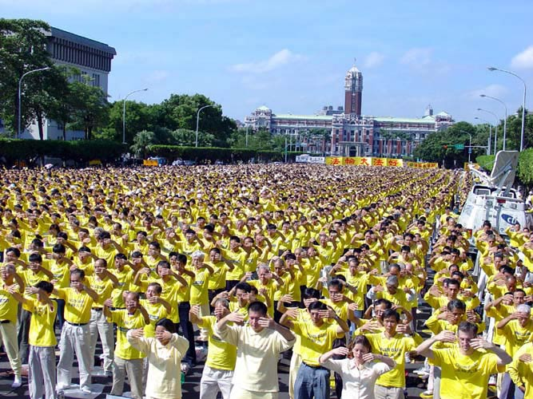 
  
【明慧网二零一四年一月七日】（明慧评论员文章）<b>法轮功是上乘佛家修炼大法，明文禁止杀生和自杀。任何以自杀、杀生行为诬陷、诋毁法轮功的人，都不敢让人系统地、不带任何观念地、静心地阅读法轮功原著，特别是《转法轮》一书，也不敢让人亲身体验法轮功的功法，因为坏人也知道：很多人都是有良知的，看见真相就不愿再相信谎言。</b>

为了各位的前程，希望大家都来看《是自焚还是骗局》这个十三分钟的录像短片，即便是在百忙之中，很值得看，不看以后可能会非常遗憾！如果能静心通读《转法轮》一书，就更好。

中共就是中共，本性绝不会改变，就如同狼绝不会变成狗或者羊。十三年前的“天安门自焚”骗局虽然早已被揭穿，但命令烧书、禁书的那些中共罪人，总是在寻找欺骗更多人的机会，想多拉一些人陪绑，其中包括海外出于各种目的想和中共走近的人，并借此延缓中共被治罪的那一天的到来。

历史上对正信的迫害从来就没有成功过，现在中共对法轮功“真善忍”真理的迫害更是从一开始就注定了失败。从1999年7月至2014年1月，这场对法轮功的政治迫害已持续十五年了，法轮功学员在中国大陆和平、理性的反迫害言行，通过海外明慧网对迫害黑幕的揭露，也持续十五年了，迫害行为赖以藏身的主要场所——劳教所已经解体，迫害走入末路之末。在这种情况下，又有人到海外拿自焚骗局作招牌，象开假面舞会似的演戏，这一次，目的是骗谁呢？

自焚真相是本世纪重大信息。知道才能心明眼亮，明白才有未来、有光明、有希望。

<b>相关历史概要：</b>

1）法轮功是佛家上乘修炼大法，以《转法轮》一书教人按“真善忍”做好人、提高道德境界，并辅以五套动作优美缓慢的功法。从1992年5月公开传出，至1999年7月，短短七年间，学炼法轮功的人数已高达一亿；因祛病健身、回升社会道德的显著功效，法轮功在中国的声誉家喻户晓。

2）1999年6月，中共专门为迫害法轮功而成立了权力凌驾于公检法之上的“610办公室”。

3）1999年7月，中共首恶江泽民、罗干出于妒嫉和个人利益，发动了对法轮功的全面迫害。但当时，中国大陆有太多的人都经历过“文化大革命”，也都知道法轮功的功效，所以对这场政治迫害不以为然，对政府发动的“百万签名声讨法轮功”等活动消极对待。同时，大批法轮功学员自发地走向北京信访办、天安门广场，为法轮功说公道话。

4）江泽民发布的密令中，最臭名昭著的是对法轮功“名誉上搞臭，经济上截断，肉体上消灭”、“往死里打，打死算自杀”、“打死不查身源，直接火化”。

5）为维持和广泛推动这场迫害法轮功运动，2001年1月23日，江泽民、罗干之流，在天安门广场推出了一场自导自演的自焚事件，并动用全中国的媒体，用这场伤天害理、残害生命的黑戏，嫁祸法轮功。

6）“天安门自焚”骗局推出一周后，人们疑问重重。于是中共操控中央电视台，推出了一个以自焚为题的“焦点访谈”节目，攻击法轮功。然而通过对“焦点访谈”的录像进行慢镜头播放和分析，人们却发现了更多的漏洞。比如，在这场事件中当场失去性命的刘春玲，不象被焚烧致死，而是被突然来自脑后的重物击打致死，而神秘的击打者是军警模样。中央电视台的自焚画面中还有王进东的现场大特写，一名警察站在他的身边，拿着灭火毯，悠闲地等着王进东喊口号，然后机械地把灭火毯盖在王的头上。“王进东”浑身衣服被烧得七零八落，可是他两腿中间装汽油的绿色塑料雪碧瓶却完好无损。

7）法轮功是佛法修炼，禁止杀生和自杀。1995年出版的法轮功主要著作《转法轮》〈第七讲〉中专门有“杀生问题”一节，其中写道：“杀生这个问题很敏感，对炼功人来说，我们要求也比较严格，炼功人不能杀生。”1996年法轮功创始人李洪志先生在《悉尼法会讲法》时，当有弟子问，“杀生是一种很大的罪业，一个人他自杀算不算罪呢？”李先生回答：“算罪。……所以自杀是有罪的。”

8）尽管江罗监制的自焚事件漏洞百出，但想在政治上捞票的人，常年将此伪案和骗人用的“标准答案”塞入中国大陆中小学校的教科书、考试题、招工表格，从儿童、青少年学生做起，制造对法轮功的恐惧和仇恨。 

<h1 align="center"><b>华盛顿邮报做出历史证言：自焚的火焰照亮了中国的黑幕</b></h1>

 
<b>在自焚事件两周后，华盛顿邮报记者菲力普•潘发表《Human Fire Ignites Chinese Mystery》（自焚的火焰点燃中国的黑幕）的调查报道，该记者到自焚者之一的刘春玲的居住地开封市采访，刘的邻居告诉记者：“没有人曾看到过她炼法轮功。”</b>
 
  
作者：菲力普.P.潘（Philip P. Pan）

【明慧网编注：2001年1月23日（农历除夕）天安门自焚事件发生之后，中共新华社一反层层请示、迟迟不报的常态，在有关公安部门值班人员尚不知晓的情况下，以惊人速度报道了自焚事件，并一口咬定此事乃法轮功所为。随即，法轮功纽约信息中心于美东时间1月23日上午通过本网站发表了题为“中共制造自焚惨案，新华社造谣陷害法轮功”的声明，稍后又通过国际媒体向中共和世界发出呼吁，呼吁尽快进行第三方独立调查。一周之后，中共掌控的中央电视台抛出自焚死亡女子刘春玲之女、12岁的小学生刘思影被焚烧后的悲惨画面，在加紧开展强征签名、大面积逮捕等一系列迫害行动的同时，公开煽动公众对法轮功的仇恨，挑动群众斗群众。
2001年2月4日，华盛顿邮报在头版发表题为“自焚的火焰照亮了中国的黑幕——当众自焚的动机乃为加强对法轮功的斗争”的惊世调查文章，向世界提供了包括以下几点在内的事实：

◆刘春玲不是开封本地人，生前在夜总会靠陪吃陪舞谋生； 
◆刘春玲曾不时殴打老母和幼女； 
◆从来没人见到刘春玲练过法轮功。

下面是上述华盛顿邮报调查文章的中译稿：】

华盛顿邮报：自焚的火焰照亮了中国的黑幕
——当众自焚的动机乃为加强对法轮功的斗争
图片说明：五名据新华社称是法轮功的成员于1月23日在天安门广场自焚；1月30日的中国国家电视中播放了该镜头。(路透社)

2001年2月4日星期日，华盛顿邮报海外报道，A01页：

中国开封消息：在这个曾经繁华的城市的东边有一个地方叫做苹果园，但这里已经没有了苹果树，而只有单调的混凝土建筑和成群失业的人在泥泞的街上闲逛。刘春玲(音译)和她12岁女儿，刘思影(音译)就住在这儿，六号楼四层的一个公寓里。

母亲是一个平静而内向的女人；女儿是一个活泼的五年级学生，从不忘记微笑并和别人打招呼。邻居们回忆了刘春玲奇怪而悲伤的遭遇：她有时打孩子，她曾把她年迈的母亲赶走，她在一家夜总会工作，靠陪伴男人挣钱。

但是没有人认为36岁的刘春玲可能会加入被禁精神运动法轮功。并且，没有人注意到她和她的女儿是何时失踪的。

接下来，他们上了国家的电视，她们的身体在天安门广场上被桔红色的火焰吞没。刘思影躺在担架上出现在镜头中，她的脸和唇呈焦黑色，呜咽着：“妈妈！妈妈！”而她的妈妈，据新闻报道说，已经死了。

开封市位于河南省中部，在北京以南350公里之外。是什么原因促使刘氏母女以及另外三个来自开封的人在1月23日，即中国的除夕，向他们自己的身体浇上汽油而点火自焚呢？一场进行中的激烈斗争正在回答这个问题。五名被选派者轮流上镜，作为邪教牺牲品，或者反对政府镇压的正直的抗议者，或者生活在快速变化的社会的边缘而被绝望地疏远了的人们。

执政的共产党发起了一场倾尽全力的运动，利用该事件来证明他们将法轮功宣布为危险的X教的正确，以将中国和海外公众的意见扭转为反对这个18个月前遭到中共取缔的团体。中共一直不遗余力地镇压这个团体，并不时对其使用暴力战术。

每天从早到晚，国家掌控的媒体都要对法轮功及其在美国的创始人李洪志发动新的攻击。学校被命令对学生进行有关该教派的“教育”；工厂、办公室和大学组织里要组织讨论和会议；远在西藏的宗教领导人也发表按演讲稿准备的谴责声明。在开封，邮电局发行了反法轮功的首日封……

中国还利用该事件向香港施加压力以取缔法轮功，这是对这个前英国殖民地对本地事务有自治权的“一国两制”的一个检验。法轮功在香港合法存在，但是保安局局长在星期四警告说警察准备密切监视该团体的活动。法轮功领导人坚持说刘氏母女以及她们的同伙应该不是法轮功学员。法轮功是一种综合了佛家，道家思想和中国传统气功的功法。他们说，法轮功明确禁止暴力和自杀，并暗示说中国政府导演了这一事件。

另一些人权活动家说这五名自焚者是为了抗议政府对法轮功的镇压，因为该镇压导致了数千人被捕，以及105人被残杀在拘留所。

在中国有出于政治动机而自杀的传统。中国上一个王朝开始的时候，是1640年，数百人宁可自杀也不生活在满洲人的统治下。大约250多年前，数名学生自杀以抗议清朝拒绝建立共和宪政。不久之前，有无数中国人放弃生命以逃避毛泽东在文化大革命中对人权的肆意践踏。

但是当众自焚却是史无前例的。在开封，这个拥有70万人口的前帝王首都，一个千年之交的世界上人口最密集的城市，大多数居民对刘和其他人的行为认识模糊。

“他们使开封蒙羞，他们是中国在世界面前蒙羞。太过分了！”汤绍华（音译），这个在刘家附近卖蔬菜的60岁的人说。

“我不是说我不相信政府，但是我也不是说我相信它，”刘晓宇（音译），39岁，她一边在开封夜市包饺子一边说。“政府控制了新闻。我们现在都知道这一点。”

出租车司机王朝辉（音译）说他认为法轮功象其他的宗教，并说谴责这个拥有数百万修炼者的团体中的5个人的行为是不公平的。无论如何，他说，对法轮功的镇压肯定要平反。

“中国现在不一样了，他们不能把所有有这种信仰的人都抓起来，”他说，“这只会把事情搞糟。”

王说中国必须面对的真正问题是为什么如此多的人信仰法轮功。“人们对社会不满，”他说。“这才是问题所在。”

象中国的其他地区一样，开封在共产主义意识形态失去吸引力后经历了各种宗教的回潮。在过去10年，大量的居民皈依基督教，佛教，道教，以及法轮功。在该团体被禁以前，有数百人在城市的公园里打坐炼功。法轮功吸引了中国各个领域的人，－－共产党员，高级军官，政府官员，教师，以及数百万生活在社会边缘的人。在开封，这个一些工厂关闭，经济衰退的城市，许多人寻求精神信仰。国家媒体对这五个自焚者为什么加入法轮功只字未提。刘思影和另外三名幸存者都因严重烧伤而住院，北京则拒绝所有对他们的探视请求。一个开封官员说，只有中国中央电视台以及官方的新华社可以与他们的亲人及同事交谈。刘家的一个来开门的男子将一切提问都推给政府。

但刘春玲在苹果园的邻居将她描述为一个生活波折并遭受心理问题折磨的女人。国家媒体说78岁的郝秀珍（音译）是她的养母。邻居说在刘去年将郝秀珍赶出家门前，她们母女经常吵架。

“她有毛病，”邻居刘敏（音译），51岁，说。“她打她母亲，她母亲就又哭又喊。她也打她女儿。”

对于刘如何养活自己，以及女儿父亲的去向也有许多问题。邻居说，刘不是开封本地人，南方广东省的一个男人为她付房租。另一些人，包括22岁的邻居魏剑（音译），说刘在当地的一个夜总会工作，她靠陪吃陪舞赚取报酬。

从来没有人见她练过法轮功。

（明慧网编译 2001年2月4日） 

<h1 align="center"><b>法新社：中国禁止烧伤者被家人探视</b></h1>

AFP：China Forbids Families of Burned Falun Gong Members From Seeing Them

【明慧网2001年2月13日】 译者注：2001年1月23日，在北京天安门广场发生5人自焚事件，法轮功方面明确表示，由于法轮功禁止杀生和自杀，并且伤者行为及言论不符合法轮功的教导，因此认为他们并非法轮功弟子。中共方面借此机会诽谤，抹黑法轮功，一口咬定5人为法轮功学员。目前法轮功方面正呼吁第三方独立调查。以下是法新社的一篇报道。

 
法新社2001年2月9日报导 --

<b>法新社北京2001年2月9日消息：中国禁止五名在天安门广场自焚人员的家属去医院探视他们，伤者中包括一个12岁的女孩，他们都仍生命垂危。

刘思影的奶奶星期五从她河南省中部的家中通过电话告诉法新社，这个女孩的所有亲属都被禁止去北京探视她。“当局说谁也不能见她，”这位老大妈不安地说。“他们命令我不得接受任何采访…我只能说这些。我必须撂电话了，再见。”</b>

除了诸如新华社这样的政府喉舌可以进入医院会见伤者，政府拒绝了所有的外国和国内记者采访伤者的要求。

负责救治伤者的北京积水潭医院的一个官员确认说，“610办公室”，这个负责调查法轮功活动的机构，禁止伤者家属以及记者的探访。该官员说，“家属都没来探视。他们必须经过610办公室的批准，但610办公室不会批准的。”

同时，警察将刘家里里外外翻了三遍，以寻找证据，另一个亲属告诉法新社。“他们拿走了一些材料。我们不知道他们拿走了什么，但是刘思影的奶奶都80多岁了，所有这些对她的压力太大了。”“我担心她受不了了，”该亲戚说。

<h1 align="center"><b>古罗马大火与天安门自焚伪案</b></h1>
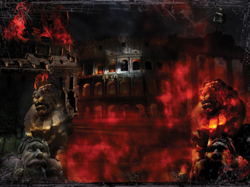 
  
文: 明理

【明慧网二零一一年十月十日】古罗马史学家泰西塔斯曾记载：“在皇帝的私人竞技场上，一些基督徒被蒙上兽皮，让狼狗活活咬死，另一些人被紧紧地捆在十字架上，点燃后作为黑夜中的火炬。身穿驭手服装的皇帝和人群混在一起欣赏。”谁是导演这场对基督徒的暴行呢？是一个名叫“尼禄”的罗马皇帝。

公元六十四年七月十八日夜晚，罗马城发生了大火，根据塔西佗的记载，大火蔓延很快，烧了五天。按普遍说法，大火是尼禄皇帝为夺取城中富贵人家的财产及嫁祸基督徒而指令军队放的。

城中十四个区有三个全部烧光，七个严重毁坏。有人说尼禄是纵火者。有些人甚至宣称看见尼禄站在高塔上穿着戏装，面对下面一片火海，弹奏着里拉琴，演唱他那关于特洛伊城陷落的民谣。

火灾之后，尼禄大兴土木，为自己建造了金碧辉煌的宫殿。人们对他更加反对了，公开说他放火是为了自己建造皇宫。面对这种指责，尼禄选中了基督徒来承担责任，先是指控他们纵火，后来又指控他们“仇视人类”。因为当时这些基督徒大都是穷人、奴隶和异乡人，迫害他们最容易。但是尼禄残酷屠杀基督徒的行为最终引起罗马人民的反对，罗马因此走向衰落和灭亡。

事隔二千年之后，在中土大地上，另一场“大火”燃烧了起来。

二零零一年一月二十三日，震惊中外的“天安门自焚”案发生。中共喉舌新华社一小时后向海外发布消息，称五名法轮功学员在天安门自焚，后改口为七名。

然而，中共的喉舌“中央电视台”播出的“天安门自焚”新闻节目疑点重重，例如，天安门广场面积大而且空旷，并没有陈列灭火器，何以在“自焚者”点燃身上汽油的短时间内就有这么多灭火器对齐“救火”？点燃汽油短时间内就会把自身烧死，“中央电视台”并不是每天二十四小时开着多台摄影机对准广场，何以有那么多摄影机多角度地把“自焚”镜头、包括特写镜头摄制下来？现场死亡的刘春玲，电视慢镜头中清晰显示是被一个身披军大衣的人从身后击中头部而倒下的……

同日，法轮大法信息中心发表题为<a href="img/35642128213.jpg">“中共制造自焚惨案，新华社造谣陷害法轮功”</a>的声明，呼吁对事件进行第三方独立调查。

二零零一年二月四日，美国《华盛顿邮报》发表的报导《自焚的火焰照亮了中国的黑幕──当众自焚的动机乃为加强对法轮功的斗争》，指无人见过“自焚”中死去的刘春玲练法轮功。

二零零一年八月法轮大法明慧网发布了《录像片：深入分析天安门自焚疑案》，揭示自焚骗局中的种种细节。

同月十四日，国际教育发展组织在联合国倡导和保护人权附属委员会第五十三届会议中发表声明，指天安门自焚事件是“政府一手导演”的，并谴责中共以“国家恐怖主义行为”迫害法轮功。

二零零三年一月二十日“追查迫害法轮功国际组织”于美国成立并宣布将“天安门自焚”事件列为第一个调查对象。二零零三年五月十四日，“追查迫害法轮功国际组织”在美国华盛顿召开新闻发布会，公布对“天安门自焚”事件的调查报告。报告显示，国立台湾大学语音实验室对“天安门自焚”事件中王进东的声音进行的独立语音分析表明，中央电视台在三次节目中所播出的王进东的声音不是来自同一个人。

二零零三年十一月八日，由北美非营利民间中文电视台“新唐人”制作的分析二零零一年天安门自焚事件的影片《伪火》（False Fire）获第五十一届哥伦布国际电影电视节荣誉奖。

至此，“天安门自焚”是中共制造、用以栽赃陷害法轮功的真相已大白于天下。

法轮功以“真、善、忍”为修炼原则，不但免费为民众祛病健身，而且普遍使人心道德回升，修炼者遍布世界各地、各个社会阶层，来去自由。法轮功明确禁止杀生，并明确指出自杀是有罪的。法轮功自一九九二年传出至今，除了中共炮制的“自焚”，无论在中国大陆和海外各国，从来没有发生过任何另外一起类似事件。

中共自一九九九年“七二零”开始迫害法轮功之后，不断栽赃陷害，为迫害制造借口。但法轮功太正了，中共使尽浑身解数编造谎言也无法掀起“斗争”高潮，于是，中共江罗集团铤而走险，重拾古罗马尼禄的肮脏手段，搞出了“天安门自焚”伪案，挑起人们对法轮功的仇恨，从而达到加剧迫害法轮功的目的。

迫害正信是不得人心的，所以强大的罗马在迫害基督教中最终走向了衰落和灭亡；今天的中共在迫害法轮功以来，为了打击“真、善、忍”而不断鼓吹“假、恶、暴、色情”的东西，使社会越来越不可收拾，中共也越来越不得人心。现在，一亿人的“三退”（退党、退团、退队）大潮已呈不可阻挡之势，明智者都抓紧时间退出中共，以保平安。

<h1 align="center"><b>突破封锁的先驱者(上) 追记12年前长春3.05插播 </b></h1>
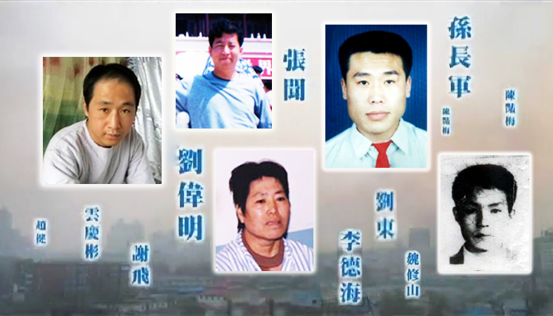 

<b>2002 年 3 月 5 日,《是自焚还是骗局》等真相电视片在长春有线电视播出,长春沸腾了! 震惊的人们纷纷电话告诉亲友同事，让他们打开电视看真相——原来天安门自焚是假的！原来对法轮功的报道是栽赃啊，原来国外都知道法轮功好啊……

这次成功的电视插播,是大陆有线电视网络争取自由、传播真相的杰作，民众都站在了正义一边。江泽民听到之后,怒不可遏地发出密令“杀无赦”！警方开始疯狂地在全城大搜捕。约 5000 名法轮功学员在长春被抓了,不计其数的人被迫流离失所,参与长春插播事件的18名法轮功学员,侯明凯在派出所被打死,15人被非法判刑4至20年(至今8人已被酷刑折磨致死),另2人失踪。</b>

文: 宇正

【明慧网二零一四年三月五日】 
目 录 

（一）梁振兴　团队的创建者 
（二）精英团队 
（三）刘成军　栋梁的传奇 
（四）沸腾的长春 
（五）英雄喋血 
（六）疯狂的审判 
（七）丹心照汗青 
（八）开创未来的先驱者 
（九）生命换来的光明

2002年3月5日晚7点19分，长春市惊愕了、沸腾了。

长春有线电视八个频道同步播出了《是自焚还是骗局》、《法轮大法弘传世界》等真相节目，震惊的人们纷纷电话告诉亲友同事，让他们打开电视看真相——原来天安门自焚是假的！原来对法轮功的报道是栽赃啊，原来国外都知道法轮功好啊……

在这强大的视觉冲击力下，40多分钟的法轮功节目，吉林省长春市30万有线电视用户，约十万人看到了真相；随后，在邻近长春的松原市，又有几万有线电视用户看到了这些节目——明白真相的人们，都站在了正义的一边！

“祝贺你们！”人们纷纷向法轮功学员道贺。很多人以为禁令解除了，法轮功要平反了，有人公开上广场散发真相传单，连监视他们的人都拍着他们的肩膀说，“好样的，了不起！”得到了本该属于自己的知情权，掀开了长期的封闭和压抑，长春人民都跟着扬眉吐气。

“马上离开！”一个军方朋友用电话给法轮功学员报信了，长春的军队要戒严了，警察全部出动，全城搜捕。原来听到消息后，当时在京参加“两会”的吉林省和长春市官员吓得直冒冷汗，恼羞成怒的江泽民下达了“杀无赦”的密令，公安部副部长刘京赶往长春限期破案。

为什么中共当局这样惊恐，这样仇恨，这样疯狂？为什么“3.05”事件能在国内、国际上产生那么大、那么持久的影响？甚至开启了突破网络封锁的新时代？还是让我们从头讲述，追记这些坚贞不屈的勇者，怎样创造了这段史诗般的奇迹。

<b>（一）梁振兴　团队的创建者</b>

<table border="0" cellspacing="3" cellpadding="3">
<tbody>
<tr>
<td align="center"></td>
</tr>
<tr>
<td align="center">图1：梁振兴，一个成功的房地产商</td>
</tr>
</tbody>
</table>
<b>浪子回头</b>

吉林省省会长春，一个并不富庶的老工业城市，梁振兴在这里过着优渥的生活。他是一个成功的地产商，没有家庭背景，通过个人奋斗，他在九十年代就拥有几十万个人资产。阔绰的生活，社会的污染，也把他变成了一个花花公子。

法轮功（法轮大法）自1992年由创始人李洪志先生从长春传出以来，吸引了数万长春人。文化广场是其中一个炼功点，梁振兴的家就在街道的另一面，他常常凝望着窗外的这群风雪无阻的炼功者，在钦佩中掺着几分好奇。终于在1996年，一个寒冷的早晨，他走进了这群人。

一切免费，热心教功。在当时普遍用气功挣钱的环境下，这无私的口号的确让人震撼。他试着一炼，感觉很好，看看法轮功主要著作《转法轮》，“真善忍”的理念让他明白了人生的真谛。他从此浪子回头，改掉了花天酒地、夜不归宿的恶习，濒临破裂的家庭重归于好。他介绍了很多亲朋好友来炼功，不久他就成了辅导员。

<b>空前的迫害 艰难的抗争</b>

法轮功的迅速发展引起了当局的恐慌。中共内部情报说法轮功短短几年就吸引了7000万人，超过了党员人数。喉舌报纸向法轮功发难，便衣特务出现在炼功点，和平请愿被记录在案。

1999年7月19日，中国的公检法、武警、军队全面进入了一级战备状态。7月20日，全国开始了大抓捕，报纸、网络、电台、电视开始全面攻击法轮功，抛出了一个个惊人的污蔑法轮功的案例（事后证明都是谎言，被揭穿后连媒体都不再提了），全面煽动着民众对法轮功的仇恨……

怎么办？梁和许多炼功人一样，他们知道“真善忍大法”是他们一生追寻的真理，如今法轮大法蒙冤，为正义伸冤、捍卫真理就成了义不容辞的责任，何况他们都是法轮功的切身受益者。那时每天都有成千上万的法轮功人士到北京上访，这是一个中国公民唯一的合法的伸冤渠道了，但是上访者都被非法抓捕，押回原籍拘禁。

这群善良的法轮功学员，他们认为精诚所至，金石为开。所以决定去北京上访，向政府讲述真相，请当局收回错误的禁令。

事实证明他们太天真了。中共的政治运动，一贯用暴力和谎言打击良善，制造血腥恐怖，维持其专制的稳定。这场运动，比起10年前的“六四”屠杀请愿的大学生，还要邪恶。中共当局就是用谣言开道，用暴力手段来铲除法轮功。当时的信访局，已经成了诱捕法轮功学员的地方。

10月1日，他们在上火车前被公安抓捕，被刑讯，被刑拘，被劳教——这一切在中共的法律里找不到依据，当局歪曲法律，制造了一起起冤案。

<b>囚室三剑客</b>

梁振兴的铮铮铁骨，让劳教所十分头疼。一个劳教所用酷刑也不能使他屈服，就想法把他推给别的劳教所去收拾。2000年，梁被转到长春苇子沟劳教所时，在那里他遇到了刘成军和刘海波，这两位难友的故事后面会集中讲到。他们“三剑客”，开始“并肩作战”。

劳教所每次攻击法轮功时，哪怕是开大会，甚至司法局、劳教委、市局的领导在场，梁振兴和刘成军等人就会当场站出来，揭露谎言，卫护正义的尊严，每次都在对他们的暴打中混乱收场。但他们毫不畏惧，下次还会挺身而出。

2001年1月23日，北京当局一手炮制了震惊中外的“天安门自焚”假案，当局说五名“法轮功抗议者”在北京天安门广场自焚，嫁祸栽赃法轮功。媒体掀起了新一轮的攻击，全面点燃了民众对法轮功的仇恨，为镇压制造借口，迫害进一步升级。江泽民下了“打死白打死，打死算自杀”的指令，当局不再限制对法轮功的酷刑，迫害致死的案例，在明慧网上几乎天天都有报道。

梁振兴和他的同伴们知道这个弥天大谎是最害人的，如何彻底揭露它、曝光它？他们在劳教所苦苦思索着。

<b>豁然开朗</b>

2001年底，他们陆续劳教期满释放。梁振兴回家后，在明慧网上看到了纪录片《伪火》。这部在第51届哥伦布国际电影电视节上获荣誉奖的影片，凭借严谨的剖析，以无可辩驳的证据，让人们看到原来“央视天安门自焚录像”破绽百出，是栽赃法轮功的一起伪案。这正是世人需要的真相。

明慧网上一篇文章让梁豁然开朗。文中提到截断电视传输，将VCD机接入线路播放真相节目的可行性——这就是他找到的最有效的方式，比以前的小喇叭广播、真相气球和海量传单更有效！

用这种全新的方式，揭露这个世纪谎言，必须要组建一个团队。

<b>（二）精英团队</b>

<b>风云际会</b>

梁振兴马不停蹄，去和长春功友们交流想法，寻觅人才。当时52岁的周润君也萌生了插播的想法，和他不谋而合。这位大姐把自己租的一处毛坯房作为基地，也去帮着组建团队。

32岁的刘伟明是有线网络电视的专业人员，精通电子技术，他毫不犹豫地来做技术攻关。

28岁的张闻，是精干的电工，他和刘伟明一起绘制了有线电视网络图。

26岁的雷明是团队的小兄弟，他来自白山市。他是快餐师，双手灵巧，还有着运动员般的身法。他创造过一个空前绝后的奇迹：在北京天安门广场上展开请愿的横幅，警察们冲上来围攻他，他竟穿出包围，把穷追不舍的警察们，迷失在蜘蛛网般的胡同里，全身而还。

31岁的李德海是通化市人，他家是养牛的，正在给他攒钱结婚。他因为讲真相被警察追捕，流亡到长春。他为人爽快，身手麻利，也成了团队的主将。

一个个精英纷至沓来，组成了一个18人左右的团队。团队有五位技术主力，这“五虎上将”除了上述4人，至今还有一位不知道名字，也许就在那些在抓捕中被整死的无辜者中。

<b>内部分歧 阻力重重</b>

该不该这么做？梁振兴在和长春功友们的交流中，遇到了空前的阻力，大多数人反对。他们认为这样会激起民众的反感，事与愿违。反对者扩散着自己的言论，希望更多的人来阻拦这个计划，梁开始感受到压力。

唐风，一位高大威严的长春功友，因为坚强不屈受到了普遍的尊重。因为有些功友对插播行动不理解，建议唐风去劝劝梁振兴、与他深入切磋、探讨一下，是否应该继续开展这一行 动。于是，唐风约梁振兴在长春市三道街街头市场见面。在熙熙攘攘、人头传递的街头，通过长时间的交流、切磋，唐风被梁振兴的心怀救度众生的大善、大勇的精神感动，认同插播 行动是可行的壮举。唐风回来后，将见面过程向功友们转述，功友们也都理解了插播的行动并正念支持。

深思熟虑之后，梁确信自己的计划是正义的，是把知情权还给广大民众，人间不该是谎言的舞台，这些真相本该属于大众。梁也知道做这件事情的风险和代价，他的女儿今年要高考，这是女儿命运的关键转折点……但看到几乎天天都有功友被迫害死，这场谎言构筑的迫害太邪恶了，而民众被谎言迷惑着扭曲了正义感，在迫害中推波助澜……他只能置个人的情感和幸福于度外。但是团队内部，会不会听到风言风语开始动摇？

<b>蓄势待发</b>

值得自豪的是，插播团队精诚一心，义无反顾。

梁振兴出资购买设备，周润君负责后勤，给大家做饭，刘伟明传授技术，有人学练，有人整理资料，还有人掩护、帮忙，配合的很默契。

但是，2002年2月16日晚上传来消息，梁对大家说：离长春不太远的鞍山市，有线电视短暂插播了法轮功真相，但没能持续……咱能成功么？

我们的技术是过关的，只要充分演练，配合得当，一定能成功！技术组的回答，给了所有人底气。于是继续推进，开始了实战演练。

大家坐公交车到郊外，在张闻的指导下，穿上电工脚蹬子，带着绝缘手套爬电线杆。刘伟明领着人们到农村“实战”。他安放插播设备，播放七彩竖格画面的光盘，让人去各家检查有线电视信号，结果很多频道都是这样清晰的影像——预演成功！

<b>主帅落难</b>

2002年2月下旬，梁振兴拖着疲惫的身体回来了——他为插播忙了两个多月了，整天在外边跑，找人手、买设备，协调团队的一切，应付内外的压力……过度的疲劳和压力几乎压垮了他。他双眼无神，坐在那直冒虚汗。

团队已经成熟了，梁在劝说下回家休息。可是刚回家没几天，2月27日，他被一个朋友的电话叫醒，催他尽快回公司整理文件。结果半路杀出了警察——诱捕！他大喊着“法轮大法好”的口号，被塞进警车。周围人交头接耳：又在抓法轮功了。

梁知道是插播走漏了消息，因为他也没干别的事。彻夜的酷刑逼供，他艰难地支撑着，也在担心着团队的安危：他们会被告密么？他们有危险么？他们何时进行？能成功么？能持续多久？能把真相节目播放完……

多想无益，酷刑何惧？扛着吧，他在牢狱中坐镇，要给大家争取时间……

<b>（三）刘成军　栋梁的传奇</b>

<b>挑起大梁</b>

得知梁被抓的消息后，很多人紧张了，酷刑逼供，梁能挺得住吗? 如果这儿也暴露了，那就前功尽弃了！转移？散伙？还是坚守？

周姨做的“最后的晚餐”，大家吃不出味道，甚至有人等着警察敲门。

但是有人不担心，他就是新来的刘成军。我们前面提到过，刘成军和梁振兴是英雄相惜的难友，他知道梁铁骨铮铮，而且他知道假如这个住所暴露了，在得到梁出事的消息前，这里就会被端了。

法轮功里没有行政式的领导，梁振兴只是一个牵头人，现在常把他们叫做“协调人”，大家志同道合，有事商量着办，全凭自愿。所以梁被捕后，团队并没有多少群龙无首的失落，只要有人挑头，大家商量，团队就可以继续前进。

最后找来的刘成军，现在主动接替了梁振兴，挑起了大梁。

<b>分兵派将</b>

3月3日晚上，也就是梁振兴被捕后的第5天，刘成军把大家召集到一起。在并不明亮的客厅里，刘成军说：因为3月6日要审判一批功友，要赶在这个之前，把真相告诉世人，在舆论上对牢狱中的功友们给予道义的支持。这样把时间提前到3月5日，行不行？

大家一致同意后，刘成军开始排兵布阵了，兵分四路！

他先对刘伟明说：“你负责长春的一条主干线。”刘伟明欣然应允。

他又笑着问孙长军：“你行不行？要行，你就负责长春的另一支主干线。”孙长军的语气有些犯难。因为长春那两条主干线很粗，操作难度很大。而孙长军负责整个插播技术的文稿，还没整理完，还没向明慧网上传。

刘成军就对张闻说：“你负责这一支吧。”张闻爽快地答应了。他是电工，钳子玩儿得特别溜，很专业。

刘成军和另一个主力说：“咱俩一伙。李德海，你领一个，我领一个，咱们四个上松原。那儿我最熟，咱们负责那里的两条干线……雷明，你配合张闻；孙长军，你配合刘伟明。”然后跟其他人说：“你们在周围正念掩护。3月5日晚上7点，插播的节目开始播放，四地同时进行。”

时间确实很紧。晚上每组先自己组装设备，每套设备在电视上显示成功后，又帮助别人互相检查了一下。带上精良的工具，还有自己改进的正规工作服，这些都是周润君精心筹备的。周润君说：“你们走吧，屋里的日用品我负责运走。这儿又会变成一个毛坯空房。”——这就是团队当时的家，简陋的没有装修的毛坯房，没有任何家具。

<b>副帅的传奇</b>

至此，故事的重心落到了接替了主帅的刘成军的身上，他的故事精彩非常，我们还得从头讲起。

图2：刘成军的全家福，右1为刘成军，中间是大姐刘琳
图2：刘成军的全家福，右1为刘成军，中间是大姐刘琳
31岁的刘成军高大魁梧，方脸直鼻，浓眉大眼，目光炯炯，显得十分威严。他家在离长春很邻近的农安县，他是仓库管理员。炼法轮功前，他是当地社会上有名的人物——很能打架，没人敢惹。但是法轮功把这个社会上的混混，变成了一个打不还手、骂不还口、舍己为人的“真善忍”的信仰者。他的巨大变化，让亲朋好友都看到了法轮功的威力。

99年中共迫害法轮功后，他几次去北京上访都被抓回来拘留。于是他改为去天安门打横幅请愿，至少这样能让人们看到有人在为法轮功鸣冤。2001年10月1日，他第三次来到天安门广场，高举横幅向人群高呼：“法轮大法好！”警察和便衣们扑了上来，他边跑边喊，直到在广场绕了三周，才被围截打倒。

他不报姓名，任凭酷刑的折磨，同时绝食抗议，用生命为大法鸣冤。他四肢被固定在北京一公安医院的病床上，灌食导致他面部、鼻腔、口腔、咽喉都严重受伤，尽管这样，他还在给周围的人讲着法轮功的真相，最后警察竟然哀求他：“你怎么才能吃饭啊？只要吃饭就放你回去。”他回答：“我要看《转法轮》。”

《转法轮》是法轮功的主要著作。中共自1999年7月20日开始，就一直抹黑法轮功，断章取义地造谣，如果人们能看到《转法轮》，一切谣言都将不攻自破。所以当局一直在对法轮功学员抄家，收缴销毁法轮功的全部书籍。但是当时很多警察在偷偷地看这本书，有不少人看后明白了一些真相，不再苟同中共的倒行逆施。

刘成军这次是幸运的，这幸运是用生命的抗争换来的。警察给他找来一本《转法轮》，不久还真放了他。也是因为那时去天安门广场为法轮功请愿的太多了，北京及其周边的城市的看守所、拘留所、收容所爆满，很多法轮功学员在酷刑折磨后仍然不报姓名，有的就释放了。这样的故事，在当时的明慧网上多有报道。

但是后来，这种幸运便不复存在，甚至变成了巨大的悲剧——在北京所有不报姓名的请愿者，整汽车、整火车地被秘密押往集中营，被集体失踪——迫害法轮功升级了，秘密活摘器官贩卖，焚尸灭迹开始了，由此造成了2003—2007年中国大陆器官移植数量蘑菇云式地暴增，在官方有据可查的数据里，有6.5万例活体器官移植没有合法来源，而当时的一些录音证明：全国很多医院疯狂地进行活体器官移植，有的大夫直接告诉咨询者：“各地医院都是这样（器官供体是法轮功学员）。”

（可通过破网软件下载电话录音证据：http://www.zhuichaguoji.org/node/35848）

刘成军回来之后，靠炼功很快恢复了身体。他知道上访、请愿都没用了，就开始在当地印刷法轮功真相传单和小册子。他开着大卡车，经由302高速公路，把整车的真相资料送到他的家乡农安县和周围的乡村，由此得到了“大卡车”的外号。

这样做风险很大，他再次被抓。在看守所里，狱警开始还想暴打他，可他走近了三米高的拘留所围墙，用犀利的目光“照”着狱警：“谁敢碰我你就试试！”

狱警们真被吓着了，于是开始流传刘成军的神话：他一口能吃下去一个包子，他是“黑社会老大”；他上边有关系……其实刘成军也仅仅是震慑他们而已，“打不还手，骂不还口”是《转法轮》中的“法理”，他从修炼开始直到生命的最后一息都没有违背过，尽管他后来遭受了无尽的殴打和酷刑的折磨。

10月末一个寒冷的早晨，人们都在熟睡，刘成军冲到墙边，翻墙而出。狱警怕担责任，把越狱的版本后来改成了“他们把刘成军放了”。

越狱在北京等戒备森严的看守所是不可想象的，但在僻远的县城却偶有发生。2000年时，唐山某拘留所，抓来的十多个去北京上访的法轮功学员从大烟道爬出，再次去北京上访，唐山市局愤怒地撤销了这个拘留所。

后来刘成军又因为讲真相被抓进劳教所，在那里结识了梁振兴，结下了这段奇缘。

现在我们把视线拉回2002年3月5日晚7点。刘成军和李德海分别带人，在松原市前郭县两条有线电视主干线上，插播了法轮功真相节目。打车回去的路上，呼啸的警车从对面疾驶而过。

回到住处，刘成军总想出去看看结果，就一个人走了。第二天上午他回来了，激动地流着眼泪说：成功了！谢谢你们！公共汽车上都在说法轮功真相，一条支线上播了20多分钟，另一条支线播了半小时，自焚真相都播完了，老百姓看明白了，县城轰动了！

（待续）

<h1 align="center"><b>突破封锁的先驱者(下) 追记12年前长春3.05插播 </b></h1>

文: 宇正

 
【明慧网二零一四年三月七日】（接上文）

<b>（七）丹心照汗青</b>

<b>监狱的摧残</b>

刘成军被关进了吉林省第二监狱（俗称吉林监狱）一大队。监狱长李强，副狱长刘长江，一大队大队长赵京，副队长王建孔指使罪犯开始实施新的迫害。

刘成军被拖到水房，臀部被打得肿得很高、溃烂，连短裤都脱不下来了，木板木棍被打折了好几根。用手编腰带抽脸、抽眼睛，腰带上的大纽扣都打碎了……目击者（刑事犯）佩服地说：“刘成军真是一条硬汉，被打时一声不吭。”

2003年8月底，在一大队坚贞不屈的刘成军，被转到五大队。赵京到五大队当大队长，和副队长林志斌，伙同罪犯郭树铁迫害法轮功学员。刘成军从来都拒绝做看守所、劳教所、监狱的奴工，因此被迫害的更为严重。刘成军绝食抗议，开始了生命的抗争。

他把自己的狱内购物卡给了其他法轮功学员，嘱咐他们都买成营养品，分给那些被关小号和其他需要补充营养的功友们。看到一位功友的衣服破了，他一边为他缝补，一边给大家唱了一首歌曲《祝福》——这是狱友自编的词曲，鼓励大家坚忍刚强，走好正法之路。功友们听着，泪流满面。

绝食10天，滴水未进，已经远远超过了绝食绝水七天即死的极限，管教戴俊这才把他送进狱内医院抢救。刘成军已被迫害得脱相，吐字说话都很困难，医院确诊为尿毒症，公安医院和吉林市中心医院都下了病危通知。

10月21日，监狱通知了家属。那时刘成军大姐，法轮功学员刘琳，第二次被劳教释放刚两天。家属赶到吉林市中心医院，那时刘成军已奄奄一息：整个人骨瘦如柴，全身到处是伤痕，眼窝深陷，看不清东西，咽喉重度感染，说话很吃力，心、肾都重度衰竭。

大姐握着他的手，哭着说：“我现在就给你办保外就医，很快就回家。”

刘成军艰难地说：“啥…也…别…执…着。”大姐也同样是坚贞不屈的法轮功学员，他看着大姐在流泪，就一个字一个字地鼓励道：“大觉不畏苦　意志金刚铸　生死无执著　坦荡正法路”（《洪吟二》〈正念正行〉），在场的人都失声痛哭。

<b>高洁而去</b>

监狱要给办保外就医，竟然被刘成军家乡农安县的“六一零”拒绝！约12月初，刘成军又被送回监狱，直接关进了小号。曾经魁梧威严、震慑狱警的刘成军，那时已经不能站立，大便失禁。

2003年12月24日，刘成军被转到长春中日联谊医院。在这圣诞节前夕的平安夜，奄奄一息的刘成军要了纸笔，写下了人生最后的五个字：“法轮大法好”。

12月25日家人赶来，见刘成军七窍流血，身上全是血，腿上脉管象拉开了，满地是血。他全身是伤，器官重度衰竭。几乎发不出声的他，艰难地指看护他的犯人说：“他，端屎、端尿，我走了，你们要善待他，救度他。”在场者无不动容落泪。

12月26日凌晨四点，经过21个月的炼狱摧残，高洁的刘成军离开了人世，年仅32岁。当天，监狱纠集大批警察，不顾家属反对，未经尸检，强行火化。

看到儿子惨死，刘成军的父亲刘长太和老伴当时就不行了，老伴哭昏了过去，刘长太嗓子当时起了一个鸡蛋黄大小的血泡，呼吸困难，差点堵死过去。刘长太老人说：“我一定要讨个公正的说法，不然我无法度过余生啊！我怎么也想不明白，一个学做好人、一心向善的人，为什么要遭到如此恶毒的虐杀？法律和公理何在？人间正义何在？他们用了什么恶毒的手段害死了我儿子？我儿子临死时鼻孔、耳朵、大腿等处都在流血，这究竟是为什么？！”

在刘成军被迫害死后，“六一零”又派人到刘家蹲坑、骚扰。刘成军的大姐刘琳2004年12月17日，又被北京市公安局非法抓捕，被通州看守所非法关押一年。

家破人亡，在不断的打击和折磨下，2005年3月28日，刘长太老人含冤而逝。

<b>丹心照汗青</b>

刘成军被害死4年后，2007年9月5日，在澳洲纽省的议会大厦，某人权基金会的颁奖典礼上，将“丹心汗青奖”，授予打破新闻封锁的“3.05长春插播团队”的代表——刘成军。

这一奖取名于南宋民族英雄文天祥的千古名句“人生自古谁无死，留取丹心照汗青。”该人权基金会说：刘成军的选择在对抗江泽民集团残酷迫害法轮功的背景下，是可歌可泣的义举。他将作为二十世纪中华民族的人权卫士，流芳百世。

颁奖的纽省上议员格尔顿•莫里斯表示，刘成军获得丹心汗青奖，是留给历史的见证。

代表刘成军领奖的张先生在致谢辞中说：“五年前刘成军和他的同伴们为了突破封锁让人们看到法轮功的真相所做的壮举，震撼了世界。这个奖项提醒人们：在中国经济繁荣假相之下，令人发指的反人类罪仍在发生。有多少人为了经济利益，正丧失人类赖以生存的道义原则，又有多少人能够预见，中共对‘真、善、忍’的打压，对传统文化和道德的摧毁，将给中国及世界带来灾难。愿这个奖项能够使更多人了解到真相的意义和价值，让我们一起来维护正义和尊严，结束这场迫害、为我们自己，也为我们的民族奠定一个美好的未来。”

未来的美好，总是在当今的苦难中孕育。我们将继续追踪这个团队的命运。

<b>（八）开创未来的先驱者</b>

大抓捕中5000多人被抓，数千家庭妻离子散；插播团队的15人被判刑，更多人被劳教；7人先后被公安局酷刑整死；在吉林监狱，刘成军被害死，云庆彬被折磨得精神失常，孙长军肋骨被打断，双肺空洞，胸腹积水，腹胀如鼓，生命垂危……但这并不是撕开谎言铁幕的全部代价，迫害还在继续。

<b>雷明 保外就医仍不放过</b>

继刘成军被监狱害死后，被判17年的雷明，在吉林监狱受尽酷刑：毒打、弹眼球、捏睾丸、上抻床、死人床……不到2年，就被残害得生命垂危，2004年被保外就医。

回到家的雷明人已残废，原来130斤的体重，只剩下70斤，奄奄一息。父母没有经济来源，仅有的一点积蓄都给儿子补养身体了。但是当局仍不放过，监狱、派出所、居民委，不断来施加压力，一旦雷明身体有所恢复，就得收监。为了不再被抓，在雷明能走路后，二老忍痛让他出去躲躲。

2006年8月6日，伤势太重的雷明，在流亡中去世，年仅30岁。老实忠厚的父母得知独生子被迫害致死后，悲痛欲绝。

<table border="0" cellspacing="3" cellpadding="3">
<tbody>
<tr>
<td align="center"></td>
</tr>
<tr>
<td align="center">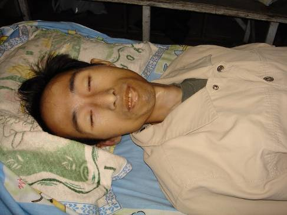</td>
</tr>  
<tr>
<td align="center">图8：雷明的两张照片，上：被迫害前；下：被监狱迫害至生命垂危，保外就医。</td>
</tr>
</tbody>
</table>

<b>魏修山 在监狱失踪</b>

魏修山，前面提到过，他是插播中的配角。他1999年因为上访被非法批劳教1年，在苇子沟劳教所时，拒绝认罪，拒穿劳教服，被恶警用电棍摧残，但他一直都没穿，连犯人都说：“真了不起，队长这么恶你都不怕，都拿你没办法。”

他给劳教犯们讲法轮功是咋回事，解开谎言的枷锁后，大家都知道法轮功好，好几个犯人说将来出去跟他学大法。他始终不屈服，被非法延期关押11个月，在解除劳教的鉴定上，他写道：“我出去后继续修炼法轮大法，证实大法是超常的科学，是能度人的好功法。”

2002年10月，他参与插播被冤判12年。在吉林监狱受尽酷刑，被折磨至生命垂危，2003年10月，送到医院后失踪。

<b>梁振兴 四个监狱轮番迫害</b>

故事的结尾，我们回到团队的主帅梁振兴身上。本系列的开头讲到：梁在插播的前几天被诱捕，在看守所里被刑讯逼供，他承受着酷刑，为团队争取着宝贵的时间。插播之后，警察发现梁振兴隐瞒了重大案件，不断地长时间提审他，每次他都是伤痕累累的被抬回来。

<table border="0" cellspacing="3" cellpadding="3">
<tbody>
<tr>
<td align="center">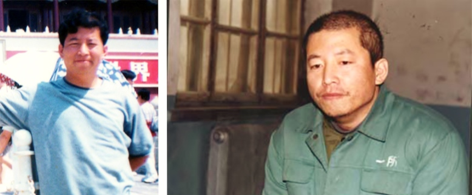</td>
</tr>
<td align="center">图9：梁振兴的两张照片，左：迫害前；右：在看守所（官网），头左部发迹上可见血污</td>
</tr>
</tbody>
</table>

在法庭上，他看到了他残缺的团队。通过大家互相鼓励的眼神，和法庭的质证，他才知道大家出色地完成了使命！这是令他最欣慰的。他和刘成军象在劳教所一样，当众揭露谎言，卫护正义，被身后的法警猛掐脖子，累得法警直换人。庭审后他又被殴打电击，后被抬回看守所。

2002年11月，被冤判19年的他，被押进吉林省第二监狱（俗称吉林监狱）。这个不见天日的监狱，对大法弟子的酷刑没有停过，如今已经至少整死20人，另有几十人致残、致疯。当时迫害梁振兴，六监区监区长魏向辉明确指示：“对法轮功人员决不能手软。”

毒打、电棍、老虎凳、抻床、死人床、关小号、插肋骨、弹眼睛、捏睾丸、指甲里钉大头针、烫烙……两年多酷刑用尽，实在没办法，人都快不行了，才转到别的监狱推卸责任。

<table border="0" cellspacing="3" cellpadding="3">
<tbody>
<tr>
<td align="center">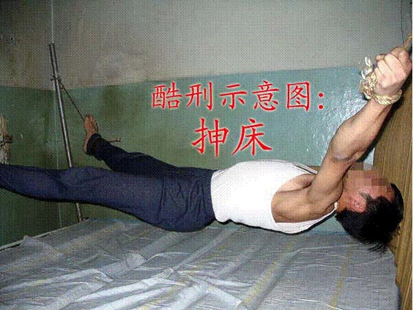</td>
</tr>
<tr>
<td align="center">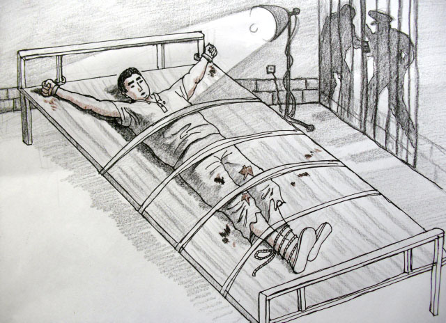</td>
</tr>  
<tr>
<td align="center">图10：酷刑抻床（上）和死人床（下）</td>
</tr>
</tbody>
</table>

2005年3月29日，他被转到长春铁北监狱。监狱惨绝人寰地迫害梁振兴，监狱里的法轮功学员纷纷起来抗议、声援。监狱害怕了，很快又给他转狱。

不管在哪里，任凭怎样折磨，他都给周围人讲真相。很多犯人同情他，敬佩他，监狱就安排最没有人性的犯人残害他。

2005年8月，他被转到最为凶残的四平石岭监狱。监区长尹首东、管教杨铁军、狱警武铁、张业军等伙同犯人，用8根电棍一齐电他，电得他全身满是焦糊斑，下体被电糊，一个乳头整个被电焦、脱落。2006年6月5日家属接见时，人们穿着短袖，梁振兴插着鼻饲管，穿着棉衣还说冷。他大哥想撩开棉衣看看，狱方匆匆将梁振兴架走。四平监狱快把他折磨死了，就又把他转走。临走时，他嘱咐那些折磨他的犯人们：“记住法轮大法好，祝你们有个幸福的未来。”很多人最终被感动了。

2010年元旦，他又被转到公主岭监狱。4月12日家属探视时，梁振兴骨瘦如柴，走路困难，声音沙哑。4月25日狱方通知家属去公主岭市中心医院，梁振兴在那里抢救，瘦骨嶙峋，右眼几乎失明，肺严重病变，脚肿的象馒头，痛苦得直咬牙……5月1日上午，铁骨铮铮的梁振兴停止了呼吸，年仅46岁。

对梁振兴的死，西人媒体这样报道：“带领发明网络信息自由才能的人死在了中国，他的死就像其他法轮功学员们一样，在历史的记录中留下了光辉的一页。”

遗憾的是，一直被封闭在监狱里的梁振兴，还不知道他和他的团队，开启、奠定了一个崭新的传播真相的时代。长春插播的巨大成功，撕开了中共谎言的铁幕，电视插播在多个地方兴起；同时，强大的宣传效果，最终促成了对互联网封锁的历史性突破——令中共金盾工程束手无策的破网软件诞生了！

<b>（九）生命换来的光明</b>

<b>不灭的真相之光</b>

暴政和迫害吓不倒真正的勇者，谎言和封锁挡不住真相的传播。长春的巨大成功之后，电视插播在封闭的大陆此起彼伏。

据自由亚洲电台报导：2002年9月6日19：15，甘肃白银市白银公司的有线电视插播了法轮功真相，持续15分钟，十万职工及家属都能看到；10月19日晚，在西南某市有线电视插播约2小时；2003年1月23日，东北某市某小区有线电视插播了“天安门自焚案真相”等内容，超过半小时。2003年8月，通过无线发射，华南地区大面积播放半个多小时，有数万民众收看到了真相……

<b>破网软件</b>

2010年1月，美国国务卿希拉里•克林顿发表演说，呼吁不管付出多大的代价也要促成国际互联网信息的自由。政府愿意拨款，去开发一个新的软件，能让公民们自由地发表意见。

只有一个群体做到了，而且早就做到了。美国《旗帜周刊》11月27 日报导，这个团体就是法轮功。他们开发的突破网络封锁的软件，不但风靡中国大陆，而且传遍伊朗，在伊朗大选消息被当局封锁的关头，破网软件成了伊朗人民向外传递信息的“救生索”。

破网软件这个创意，源于长春的3.05插播，梁振兴的团队突破了有线电视网络的封锁，出乎意料的巨大效果，推动了法轮功团体对互联网封锁的突破。

<b>为了民众的知情权</b>

美国记者伊森•葛特曼（Ethan Gutmann）这样写道：“全球互联网自由联盟”（Global Internet Freedom Consortium），这个主要由海外修炼法轮功的电脑工程师组成的群体，近年来开发出自由门、无界浏览和动态网等突破网络封锁的软件，帮助数以百万计的中国大陆民众绕过中共设立的防火墙，获得自由世界的资讯……所有这一切都是从长春这个城市开始，开始于一个叫梁振兴的人……尽管这个人从来没有得到过诺贝尔奖，但这位辞世的人是真实存在的。”

谎言扭曲了同胞们的良知，扭曲了人们的正义感，掀起了人们对“真善忍”信仰者仇恨——而真相化解了这一切，把知情权还给了民众。明白了真相的人们，都站在了正义的一边，奔走相告着真相的消息，甚至在长春3.05插播的次日，上万人自发到长春法院，去谴责中共，声援被审判的真相传播者——公道自在人心。

传播真相的正义之举，在任何一个正常的社会中，都是受到鼓励的。从插播电视，到建立起数十万个家庭真相资料点，中国大陆的真相遍地开花；在海外，从创办自由媒体，到开发出一代代突破网络封锁的软件，法轮功真相已经传遍全世界。如今，法轮功洪传世界百余国，逾1.5亿明白真相的中国同胞在海外大纪元网站上声明三退（脱离中共党、团、队组织），选择自由美好的未来，这正是人心所向，天象所趋。

避难到美国的张忠余，前面我们讲过的那位《兰台内外》杂志的副总编，如今感慨地说：“恐怖高压阻隔不断人们对真理的渴求，谎言与暴虐改变不了人心。尽管14年的血雨腥风使无数人身心受到摧残，令千万个家庭破碎，但自古以来，迫害正信者从来都没有成功过，中共在自毁中走向分崩离析，而法轮大法洪传世界一百多个国家和地区，给世界以希望与光明。”

突破封锁，还给大陆人以知情权，长春的法轮功学员，特别是插播团队，他们义薄云天，无私无畏的壮举，照亮了大陆这段最黑暗的历史。为争取新闻自由、言论自由、信仰自由，为最基本的知情权，中国乃至全世界的法轮功学员们，做出了巨大的付出。

（全文完）

<b>相关评论文章</b>

<h1 align="center"><b>法轮功禁止杀生和自杀</b></h1>
【明慧网二零一四年一月七日】（明慧评论员文章）法轮功是上乘佛家修炼大法，明文禁止杀生和自杀。任何以自杀、杀生行为诬陷、诋毁法轮功的人，都不敢让人系统地、不带任何观念地、静心地阅读法轮功原著，特别是《转法轮》一书，也不敢让人亲身体验法轮功的功法，因为坏人也知道：很多人都是有良知的，看见真相就不愿再相信谎言。

  
为了各位的前程，希望大家都来看《是自焚还是骗局》这个十三分钟的录像短片，即便是在百忙之中，很值得看，不看以后可能会非常遗憾！如果能静心通读《转法轮》一书，就更好。

中共就是中共，本性绝不会改变，就如同狼绝不会变成狗或者羊。十三年前的“天安门自焚”骗局虽然早已被揭穿，但命令烧书、禁书的那些中共罪人，总是在寻找欺骗更多人的机会，想多拉一些人陪绑，其中包括海外出于各种目的想和中共走近的人，并借此延缓中共被治罪的那一天的到来。

历史上对正信的迫害从来就没有成功过，现在中共对法轮功“真善忍”真理的迫害更是从一开始就注定了失败。从1999年7月至2014年1月，这场对法轮功的政治迫害已持续十五年了，法轮功学员在中国大陆和平、理性的反迫害言行，通过海外明慧网对迫害黑幕的揭露，也持续十五年了，迫害行为赖以藏身的主要场所——劳教所已经解体，迫害走入末路之末。在这种情况下，又有人到海外拿自焚骗局作招牌，象开假面舞会似的演戏，这一次，目的是骗谁呢？

自焚真相是本世纪重大信息。知道才能心明眼亮，明白才有未来、有光明、有希望。

相关历史概要：

1）法轮功是佛家上乘修炼大法，以《转法轮》一书教人按“真善忍”做好人、提高道德境界，并辅以五套动作优美缓慢的功法。从1992年5月公开传出，至1999年7月，短短七年间，学炼法轮功的人数已高达一亿；因祛病健身、回升社会道德的显著功效，法轮功在中国的声誉家喻户晓。

2）1999年6月，中共专门为迫害法轮功而成立了权力凌驾于公检法之上的“610办公室”。

3）1999年7月，中共首恶江泽民、罗干出于妒嫉和个人利益，发动了对法轮功的全面迫害。但当时，中国大陆有太多的人都经历过“文化大革命”，也都知道法轮功的功效，所以对这场政治迫害不以为然，对政府发动的“百万签名声讨法轮功”等活动消极对待。同时，大批法轮功学员自发地走向北京信访办、天安门广场，为法轮功说公道话。

4）江泽民发布的密令中，最臭名昭著的是对法轮功“名誉上搞臭，经济上截断，肉体上消灭”、“往死里打，打死算自杀”、“打死不查身源，直接火化”。

5）为维持和广泛推动这场迫害法轮功运动，2001年1月23日，江泽民、罗干之流，在天安门广场推出了一场自导自演的自焚事件，并动用全中国的媒体，用这场伤天害理、残害生命的黑戏，嫁祸法轮功。

6）“天安门自焚”骗局推出一周后，人们疑问重重。于是中共操控中央电视台，推出了一个以自焚为题的“焦点访谈”节目，攻击法轮功。然而通过对“焦点访谈”的录像进行慢镜头播放和分析，人们却发现了更多的漏洞。比如，在这场事件中当场失去性命的刘春玲，不象被焚烧致死，而是被突然来自脑后的重物击打致死，而神秘的击打者是军警模样。中央电视台的自焚画面中还有王进东的现场大特写，一名警察站在他的身边，拿着灭火毯，悠闲地等着王进东喊口号，然后机械地把灭火毯盖在王的头上。“王进东”浑身衣服被烧得七零八落，可是他两腿中间装汽油的绿色塑料雪碧瓶却完好无损。

7）法轮功是佛法修炼，禁止杀生和自杀。1995年出版的法轮功主要著作《转法轮》〈第七讲〉中专门有“杀生问题”一节，其中写道：“杀生这个问题很敏感，对炼功人来说，我们要求也比较严格，炼功人不能杀生。”1996年法轮功创始人李洪志先生在《悉尼法会讲法》时，当有弟子问，“杀生是一种很大的罪业，一个人他自杀算不算罪呢？”李先生回答：“算罪。……所以自杀是有罪的。”

8）尽管江罗监制的自焚事件漏洞百出，但想在政治上捞票的人，常年将此伪案和骗人用的“标准答案”塞入中国大陆中小学校的教科书、考试题、招工表格，从儿童、青少年学生做起，制造对法轮功的恐惧和仇恨。

<h1 align="center"><b>李玉强——自焚骗局背后的鬼魅</b></h1>

文: 了然

【明慧网二零一四年一月十五日】江泽民为规避法律，逃脱制裁，在对法轮功制定迫害政策时就有这么一条：“一般不发红头文件，只密码电传或口头传达，不署名，一概说是‘中央批示’”。所以，那些参与迫害的上层官员平时表现得非常低调，连他们担任的迫害法轮功的职务都不在公开报道中提及。

  
例如最近被中共抛出的李东生，过去提到他的职务就是宣传部副部长、中央电视台副台长或公安部副部长。而他主要担任的迫害法轮功的“610”办公室副主任、主任及中共中央处理法轮功问题领导小组副组长的职务就鲜少提及。同样，对于炮制的构陷法轮功的伪案中所牵扯到的恶徒，中共也是能隐藏就隐藏，能掩盖就掩盖，能不让露面就不让露面，其目的除规避法律逃脱制裁外，还有更重要的一点，就是避免民众对这些参与者直接进行质疑。

中共炮制天安门自焚伪案后，在央视的“焦点访谈”节目中有一个系列性的报道。在有关自焚的所有的采访报道中只有一个叫“李玉强”的女记者。按照常理，这么大的震惊世界的案件应该有一些著名的记者出面担纲报道才是。可是这个“李玉强”，是一个随着自焚的发生而现身的人物。自焚前，没有人知道她的身份和她的姓名；自焚后，她的名号虽为外界所知，但是关于这个女人的所有视频与图像，从来没有正面显露过，电视中的所有镜头都是利用侧面或背景来代替，民众对她是只闻其声未见其面。她的神秘直到今天都没有人能揭开。可见中共对罪恶的包裹是如何的处心积虑！

李玉强究竟何许人也？自焚前名不见经传；自焚后的十年间，连中央电视台的工作人员中，竟然都没有人知道她。中央电视台一名工作人员向海外媒体披露李玉强的情况时说：“其实她不是编制内的，我们也不知道她打哪来。其实她做的那些节目，我们内部的很多人也都不喜欢，都想躲她远些，怕沾上晦气。她自己都不露脸儿，平时都鬼鬼祟祟的。”

其他的工作人员也分别表示：“她是上头派来的，我们也管不着”，“她属于610直接管的”，“她专做这种（诽谤）法轮功的节目”，“我们也不知道她的去向”，“我们联系不到她”……更多的央视人员表示，根本不认识她，不知道她的来历。

这不奇怪吗？报道中说她是央视的记者，可是央视竟然无人知道她，你说她有多神秘！这非常明确的说明：“610”炮制天安门自焚伪案之前，对所涉及到的一切都作了精细的部署。

但是，在央视也不是说所有的人都不知道她，李东生应该非常了解她。因为李东生当时任中央电视台副台长，而且还是中共中央“610”办公室副主任，是江泽民集团迫害法轮功主抓宣传的重要头目，所有在央视播放的构陷法轮功的节目应该都得经过他的审批。李东生很可能就是李玉强最直接的顶头上司。

炮制天安门自焚伪案这样的惊天大案，任何一个政府部门都不可能单独完成。它涉及到情报、公安、卫生、宣传、外交等诸多部门，但就公安部门来讲，就涉及国保、国安、特警、交警与天安门执勤的警察等。能将这一切统筹在一起进行操控的只有迫害法轮功的“610”，因为在迫害法轮功之初，江泽民就赋予了“610”凌驾于法律与政府之上的一切权力。中共中央“610”不管是谁主使炮制了这桩伪案，都少不了在中央“610”办公室内主抓宣传的副主任、又时任广播电影电视总局副局长的李东生。李东生在这之前担任过中共电视台副台长，主抓的就是“焦点访谈”。他本人就是靠在央视创办焦点访谈起家的。

二零零二年初，李玉强曾在河北省会“法制教育培训中心”，和被非法关押的法轮功学员进行过所谓的“座谈”。当时有法轮功学员问她自焚镜头的种种疑点和漏洞，尤其是已烧得焦黑的王进东，两腿间夹的盛汽油的雪碧瓶子却完好无损的漏洞。面对大家有理有据的分析，李玉强不得不承认：王进东腿中间的雪碧瓶子是他们后放进去的，此镜头是他们“补拍”的。这也充分说明，李玉强不只在自焚后对自焚者进行了采访，而且在自焚时，她本人就在现场。也就是说，李玉强全程参与了自焚伪案的炮制，并且随后又制作了诬陷法轮功的系列访谈。

一个不为央视工作人员所知的女人能对外打着央视记者的名义进行采访并在央视进行系列报道，谁有这样的权力？看来只有在“610”内掌管宣传的头面人物，又对央视非常熟悉的李东生能做出这种邪恶而周到的安排。

向来低调的李东生被抛了出来，而且将他十多年来最大的罪恶职务也一并抛出。李东生在迫害法轮功的十四年中，尽管他的职务能从宣传部门调到公安部门，可是这样的变动又完全是以他“610”办公室主任的身份而进行的调整。李东生被宣布的罪名是“严重违法违纪”，这当然包括他担任“610”办公室副主任、主任职务时所犯下的一切罪恶。审理李东生的违法违纪，必定少不了他参与炮制的天安门自焚伪案。届时，李玉强的本来面目必将大白于天下。

<h1 align="center"><b>为自焚者开的绿灯为何如此诡异？</b></h1>

文: 他山

  
【明慧网二零一四年一月十四日】为中共江泽民集团站台的大陆商人陈光标，在大陆大肆炒作一番之后跑到美国，宣称要收购美国《纽约时报》。尽管是痴人说梦，仍然于二零一四年一月七日在纽约举办了所谓的“新闻发布会”。而发布会的主题则变成了他重新炒作十三年前的天安门自焚案，声称要为自焚者郝惠君和陈果母女捐款整容。其“挂羊头卖狗肉”之举，令舆论大哗。

  
众所周知，“天安门自焚”是由中共江泽民集团导演的一场栽赃法轮功的闹剧。二零零一年八月十四日，“国际教育发展组织”就在联合国会议上，就“天安门自焚事件”强烈谴责中共当局的“国家恐怖主义行径”，指责中共对法轮功的构陷，涉及惊人的阴谋与谋杀。声明指出：录影分析表明，整个事件是“政府一手导演的”。中共代表在证据面前，无词以对，尴尬狼狈。依据中共发布的自焚录像制作的电影《伪火》荣获了第五十一届哥伦布国际电影电视节荣誉奖。可以说在国际上，天安门自焚已经被公认是中共栽赃法轮功的一桩伪案。

面对国际舆论的谴责，毫无道德底线的中共却仍然在国内坚持着它的谎言。中共不但封锁外界关于天安门自焚伪案的任何资讯，还将参与自焚者软禁起来，完全与世隔绝。二零零五年一月二十四日明慧网披露：“陈果母女一起被软禁在开封市北郊福利院中，有一名叫展金贵的开封市公安局退休警察，负责对陈果母女的禁卫。公安人员常年二十四小时值班，她俩不得与任何外人接触。”

在如此严密监禁的情况下，陈光标是怎样将郝惠君、陈果带出国的呢？郝惠君母女从她们参演了自焚伪案后，从来都没有自由过。而将此二人软禁起来的指令绝对不可能是一个市政府或省政府作出的指令，发出这个指令的最低机构也得是中共中央“610”。中共软禁她们的目的，一个是害怕外界对她们的直接调查，另一个则是为了日后的再次利用。

陈光标作为一个商人，能将严密监禁状态中的自焚者带出国，肯定得到了江泽民集团的指令。将自焚者带出国的时机又是政法系统遭遇清洗、迫害法轮功的“610”办公室主任被调查之际。

由此看来，为母女俩开的绿灯是何等的诡异。不但没有中共高官开绿灯自焚者出不了国；十三年前，没有高官特许的绿灯，自焚者也根本达不到自焚的目的。

原中国铁道建筑总公司职工李志河曾撰文提到：中共在二零零一年一月二十三日一手导演的“天安门自焚”丑剧，实在是让我震惊！因为那天早上我一上班，单位领导就找我谈话说：“今天上午十点开始天安门地区全部戒严，你这几天哪儿也不能去，特别是不能去天安门。”后来“天安门自焚”事件一出来，我全明白了。大家可能也都看到了，中央电视台导演的那个自焚录像中，广场上除了警车、警察和救火的、自焚的，还有谁？戒了严的广场为什么就偏偏放这几个自焚的人进去？

陈光标重抄自焚伪案的消息一传出，一位北京法轮功学员就在网上曝光了“天安门自焚”伪案发生时，她所亲历的一些片段。她写道：二零零一年天安门自焚事件发生前，北京当地片警上门让她写“春节期间不出门”的保证书。片警说，江泽民下令：春节期间公安系统要确保法轮功学员去天安门的人数为零！如出现一个法轮功学员去到天安门，公安系统就会被层层追究责任。这可难住了公安系统，有人出主意让户籍警挨家挨户的登门让法轮功学员写保证：保证春节期间不外出，不写就送去拘留所。

这位法轮功学员出于为片警的考虑签了名。可是当天晚上，片警又来了，说所长不放心，派他到家看着她不许外出，还说： “今天你们有七个法轮功学员在天安门自焚了……”学员说这不可能，不写保证的都被拘留了，“我写了保证你还到我家看着我，有谁能去天安门？”她还想起最近表弟想步行穿过天安门，刚从地铁口出来，就被搜身，不许他接近天安门。

显然，中共炮制天安门自焚时，对天安门广场的戒严是何等的严厉。那么那些自焚者们是怎么走进了天安门广场？谁为他们开了绿灯？看看中共当时播放的自焚录像就什么都明白了，自焚者一点火，瞬间就象变戏法一样拿出了一二十个灭火器，原来这一切都是被安排好了的。

法轮功明确要求修炼人都不能自杀和杀生，自称是法轮功修炼者的郝惠君母女连这个最基本的道理难道都不知道？她们是有意的配合了中共，还是被中共设置了圈套？中共为何要囚禁她们十三年？从中共两次为她们打开绿灯的诡异中，人们很容易辨别出自焚案的真伪。

<h1 align="center"><b>奸商纽约跳梁　再曝自焚骗局</b></h1>

文: 飞鸣

【明慧网二零一四年一月八日】大陆一名商人作势要收购《纽约时报》，可是今天（2014年1月7日）在纽约的记者会上，却让两个烧伤患者背诵中共栽赃法轮功的台词，并声称要帮助她们整容。这种依附中共权势的商人是奸商，这种以行善为名做奸恶之事者是流氓。看够了恶俗炒作的公众不会被奸商的跳梁丑剧所欺骗，奸商的表演只能展示自己的下作，只能再次曝光其身后鬼魅所导演的自焚骗局。

  
任何人被烧伤都是值得同情的悲剧，可是这不等于被烧伤者可以被有权有钱者利用来煽动仇恨。发生在2001年1月的天安门自焚是中共导演的骗局，被中共江泽民集团大肆炒作煽动仇恨，加剧对法轮功善良民众的血腥迫害，造成难以计数的法轮功学员被酷刑折磨致残、致死。

如今，这个奸商在纽约上演丑剧，虽然在海外不会造成什么影响，却会被中共一言堂的喉舌媒体出口转内销，用来在国内再次煽动仇恨，不知又会有多少无辜的法轮功民众遭到迫害，不知又会有多少信仰真善忍的好人被关入洗脑班被灌输奸商的谎言。奸商今后依附权势所赚的钱将会是血钱，是其无法偿还的罪恶。

法轮功明确禁止杀生和自杀，在自焚事件发生之前的九年（1992年～2001年）和之后的十三年（2001年～2014年），在中国大陆和海外，从来没有发生过一起法轮功学员自焚的事件。自焚者的所作所为和法轮功的教导背道而驰，她们的行为怎么能算在法轮功头上呢？

奸商把两个自焚烧伤者当作演员背诵中共栽赃法轮功的台词，有记者问自称叫“陈果”的烧伤者：记者自己也读过法轮功的书籍，法轮功认为自杀、杀人都是不对的，并没有鼓励自焚的内容，为什么还要去自焚，而且还把后果都算在法轮功身上呢？

这个烧伤患者“陈果”回答说：是听信了刘云芳的话，刘云芳是整个事件的策划人。

可见，“陈果”的自焚和法轮功没有关系，而是被一个叫刘云芳的人误导。这个刘云芳就是中共喉舌所谓的“自焚”七人中的一个，是那个在现场没有给自己浇汽油的人，此人来历不明，至今不敢面对海外媒体的质证。除了刘云芳，还有一个叫刘葆荣的自焚未遂者，她在中央电视台上的表演前言不搭后语，她说的什么“黑烟”、“白烟”等荒诞不经的言论在法轮功的书籍中根本找不到踪影，是中央电视台杜撰的胡言乱语。她在电视中说自己在自焚前喝了半瓶汽油也是荒唐的假话。自焚为什么要喝汽油？喝了半瓶汽油竟然没有中毒？中共造假漏洞百出，中央电视台兜售自焚骗局的“焦点访谈”实为“焦点谎谈”。

 
  
发生在2001年1月23日（大年除夕）的自焚过程不过两分钟，警察手里出现了很多个灭火器，显然是提前预备好的。央视播出的镜头有近景、远景和特写，而且有麦克风录下的口号，摄影师甚至抓拍到小孩喊妈妈的镜头。自焚者之一的王进东在电视画面中点火自焚后，两腿间的雪碧瓶竟然完好无损，里面的半瓶液体被央视指证为汽油，在烈火中也没有燃烧。警察拿着灭火毯，对镜头摆姿势不给王进东灭火，等王喊完莫名其妙的口号，才把灭火毯盖在王的头上。显然，这场所谓的“自焚”是中共导演的假戏。这场假戏一经播出，其穿帮之处就立即被戳穿。如今奸商在纽约再次替中共重复早就被揭穿的谎言，深得中共厚黑之劣。

奸商号称要收购《纽约时报》，不过是个吸引视线的幌子，其目的是替中共重炒自焚冷饭。中共霸占了大陆所有的媒体撒谎行骗、煽动仇恨，自由社会的媒体怎么会被依附于中共的奸商所收买？和《纽约时报》齐名的《华盛顿邮报》在自焚事件发生后的2001年2月4日，在头版发表题为《自焚的火焰照亮了中国的黑幕——当众自焚的动机乃为加强对法轮功的斗争》的调查文章，文章说，死于自焚的刘春玲的邻居们从来没有人见她练过法轮功，邻居将她描述为一个生活波折并遭受心理问题折磨的女人，她打她的养母，在夜总会靠陪吃陪舞赚取报酬。

这些说明刘春玲不是法轮功学员。法轮功教人向善，提升道德。法轮功学员绝不会殴打父母，也不会做“三陪”这种工作。有心理问题的刘春玲和她的12岁的女儿刘思影成了中共造假的牺牲品而惨死，可怜的小女孩刘思影至今仍然被中共的中小学课本用来向天真的孩子们灌输诋毁法轮功的谎言。

<table border="0" cellspacing="3" cellpadding="3">
<tbody>
<tr>
<td align="center">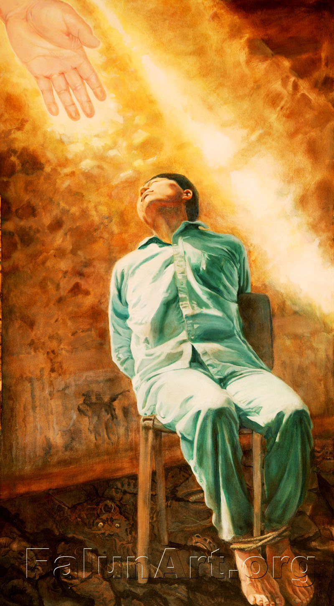</td>
</tr>
<tr>
<td align="center">真善忍美展画作:“刘成军坚忍不屈的精神</td>
</tr>
</tbody>
</table>

假如奸商还有一点天良真的想要行善的话，他应该帮助那些被中共虐杀的法轮功学员的父母和孩子，尤其是刘成军、梁振兴等人的亲人，他们因为插播有线电视揭露自焚骗局而被中共活活折磨致死。他也可以帮助高蓉蓉等人的家人。高蓉蓉女士因为拒绝接受中共劳教所的所谓“转化”而被电击毁容，直至被折磨致死。他还可以帮助那些被中共酷刑折磨致残的法轮功学员，中共的监狱、劳教所和洗脑班在酷刑“转化”这些法轮功学员时，还在强迫他们观看中央电视台关于自焚伪案的“焦点谎谈”。奸商在纽约上演的丑剧，是在往他们的伤口上撒盐。

<table border="0" cellspacing="3" cellpadding="3">
<tbody>
<tr>
<td align="center"></td>
</tr>
<tr>
<td align="center">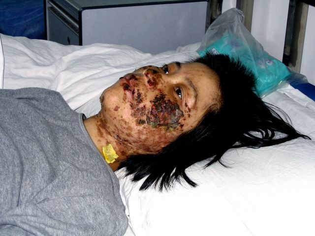</td>
</tr>  
<tr>
<td align="center">2004年5月，沈阳市法轮功学员高蓉蓉（女，37岁）被沈阳龙山教养院连续电击致面部严重毁容，生命垂危。2005年3月，高蓉蓉被马三家劳动教养院关押，同年6月16日被迫害致死。</td>
</tr>
</tbody>
</table>

即使奸商不想帮助法轮功学员和家人，他也可以帮助因抗议城管暴行愤而自焚的小贩（这类自焚是真正自发的自焚，是中共喉舌媒体从来不高调报道的自焚），他还可以帮助因抗议拆迁而集体喝毒药自杀的访民。奸商是不会做这些的，奸商声称要在美国帮助自焚者整容，其实奸商是在帮助中共江泽民集团整容，为这个沾满民众鲜血的犯罪集团整容。

奸商有小聪明但是没有大智慧。当前，迫害法轮功的“610办公室”的现任头目李东生和610的上司周永康已经成为阶下囚，而李东生在成为610头目之前任职中央电视台，因为通过焦点谎谈节目兜售自焚骗局得以升官发财。但是结果呢？这两人都是以害人始，以害己终。此次纽约丑剧，不过是奸商幕后牵线者的狗急跳墙，丝毫无济于事，只能加速其覆灭。

老百姓这些年常说：人在做，天在看。利令智昏，投机取巧，到头来机关算尽，反误性命。奸商之变诈几何哉？止增笑耳。

<h1 align="center"><b>中共制造“自焚”惨案，新华社造谣陷害法轮功</b></h1>

文/法轮大法信息中心

  
【明慧网二零零一年一月二十三日】 自1999年5月中共公安部抛出“香山集体自杀”的谣言以来，江泽民一伙陷害法轮功学员“自杀”的谣言和行动一直都在暗中多方进行，至今从未曾间断过。大陆各地也一再传出大陆公安和地方政府在严刑逼供时威胁法轮功学员说“上面说了，打死就算自杀”的控诉。

  
日前新华社抛出所谓法轮功学员春节之际在天安门广场“自焚”的诽谤“新闻”，其用心无非在于为江泽民把法轮功说成“邪教”和进一步血腥镇压法轮功制造依据。

所有认真读过《转法轮》的人士都非常清楚：法轮功严禁杀生。自1992年5月法轮功问世以来，亿万法轮功学员一直都在坚持“真善忍”的修炼原则，反对任何形式的杀生，因此更不会如此残忍地对待自己的生命。

众所周知，江泽民政权贪污腐败，蔑视宪法法律和百姓的基本人权，已经把改革开放中的中国大陆搞得哀鸿遍地、危机四伏。下岗工人示威、农民绝望而暴动、军队为瓜分钱财火并，民怨民冤如积蓄中的火山岩浆，抗议之声此起彼伏。18个月以来，无端受到残酷镇压的法轮功学员持续和平请愿，自然形成了天安门广场一个最为引人注目的请愿团体，但法轮功决不是因投诉无门而在天安门广场请愿的唯一一个民众团体。新华社抛出的所谓天安门“自焚”惨案，是中共直接或者间接地一手造成的，现在他们不但不思悔过，反而拿来进一步栽赃法轮功，实为丧尽天良、无道致极。

关心时事的人们可能还记忆犹新，不久前中共外交部刚刚对外声称“没有一个人因为修炼法轮功而被关进劳改营”就爆出了仅马三家子一个劳教所便关有数百名法轮功学员的媒体新闻。加拿大公民张昆仑教授因炼法轮功而被多次拘留、施以电刑并被判劳教三年的大量事实报道，更是对中共谎言宣传的有力驳斥。

在此，我们严肃声明，新华社所谓的自焚报道纯属栽赃陷害。法轮功学员从来没有、今后也决不会采取任何形式的杀生行为。同时，我们呼吁各国媒体，警惕中共宣传中一贯使用的欺骗伎俩，以免被江泽民利用，卷入血腥肮脏的红色政治。

（2001年1月23日午）

<h1 align="center"><b>汽油剧毒能毒死人</b></h1>

【明慧网二零一三年六月七日】2013年6月3日《钱江晚报 》报道了一则《误把汽油当饮料，三岁儿子没能救回来》的新闻。
文中说：5月31日下午，在义乌后宅出租房里，章某见自己的摩托车没油了，便从房间里提来一只装有汽油的饮料瓶给摩托车加油。这时，儿子正在旁边玩耍。几分钟后，章某在房间里突然听到儿子的哭叫声，跑出来一看，发现儿子将塑料瓶里的汽油喝到肚里了。章某见状，赶紧给儿子喂水，并拨打120求救。等送到稠州医院抢救室，医生检查发现孩子已经脉搏微弱，经多名专家抢救无效后死亡。一次对汽油的误食造成小孩的死亡，造成了一个巨大的悲剧。

可见汽油的毒性是很大的。但是很多人不知道其中的厉害，因为在生活中也很少有这样的经验教训。不过，这则新闻让我想起12年前的另一个关于喝汽油的报道，当时很多人以为报道是真的。但是细看就知道事情的真伪。

在2001年1月23日（农历除夕）天安门广场假自焚事件中，中央电视台报道“自焚未遂”的刘葆荣在自焚现场张嘴猛喝几口汽油……，事后数日刘某在接受采访时却觉得喝汽油没有什么中毒症状，也没有谈到喝汽油后被抢救的经历。为什么呢？因为她根本就没有喝汽油，也没有被送到医院抢救，所以她也不知道喝汽油是极其痛苦的，而且会导致人死亡，而中央电视台的那些个造假记者们和这个事件阴谋策划者也不知道这个喝汽油的严重性，所以就没把喝汽油当回事，觉得反正是撒谎，以为添点喝汽油的细节可增加谎言的可信性，谁知道是越描越黑，欲盖弥彰。而许多老百姓也不知道这一点，但是今天看了这个小孩误食汽油身亡的报道，在活生生的案例面前，人们知道了喝汽油的严重性，对比之下，也就更加清楚看到了中央电视台的造假报道。根据医学资料，口服汽油每公斤体重7.5 克即致人死亡。刘喝半瓶大雪碧瓶的汽油竟没有一点中毒症状，这分明是骗人！

在天安门假自焚案中还有诸如：小女孩气管切开能唱歌；假自焚者王进东的头发、眉毛烧不着等等违背常识的事情，相信你通过这些事实，能够看清天安门假自焚案的骗局，了解真相，不要再被中共邪党的愚民宣传迷惑！

<h1 align="center"><b>自焚谎言十二载　人心觉醒真相明</b></h1>

文: 唐恩

【明慧网二零一三年一月二十三日】一九九九年七月二十日中共江氏集团动用整部国家机器迫害法轮功，为了实行“肉体上消灭、经济上搞垮、名誉上搞臭”的灭绝政策，不断制造“假新闻”，编造一连串自焚、杀人、敛财等弥天谎言，企图激发民众对法轮功的仇恨。这些“假新闻”中，荼毒世人最严重者，莫过于二零零一年一月二十三日炮制的“天安门自焚事件”，意图诬蔑陷害法轮功，以所谓的五人“自焚”谎言欺骗海内外民众。

  
<b>天安门自焚伪案 漏洞百出</b>

如果把十二年前的中央电视台“天安门自焚事件”录像画面进行慢镜头分析，便会暴露出很多疑点，说明这场“自焚”事件完全是一场精心布局的预谋与骗局。

一、在“自焚”事件中被大面积烧伤的小女孩刘思影气管被切开后四天就能接受采访并能唱歌。

二、《焦点访谈》录影证实，刘春玲没被火烧死，却被警察用重物击打头部倒下。

<table border="0" cellspacing="3" cellpadding="3">
<tbody>
<tr>
<td align="center">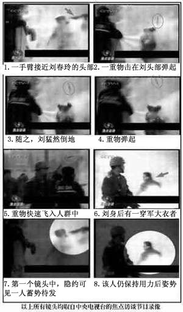</td>
</tr>
<tr>
<td align="center">央视天安门自焚镜头的慢动作重放证实刘春玲是被警察打死，天安门自焚是中共策划的一场骗局。</td>
</tr>
</tbody>
</table>

三、天安门巡逻的警察几分钟内从两辆警车里拿出二十多个灭火器和灭火毯“应付”该起“突发事件”。

四、北京积水潭医院治疗“自焚”大面积烧伤者，不作任何防护，允许记者近距离采访，完全违反医学常识。

五、“王进东”在自焚时衣服已被烧焦，但是最易燃烧的头发还在头上，他腿间的盛满汽油的雪碧瓶却完好无损。在他喊出那句似是而非的口号之前，警察手中的灭火毯却在他头上悠闲的摇晃很久，没有丝毫灭火的急迫。

<table border="0" cellspacing="3" cellpadding="3">
<tbody>
<tr>
<td align="center">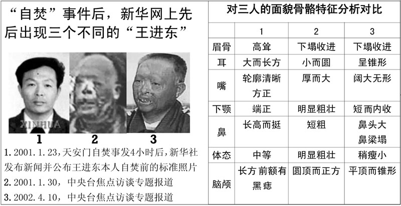</td>
</tr>
<tr>
<td align="center">“王进东”的三张对比照片证明自焚是伪案</td>
</tr>
</tbody>
</table>

六、在央视和新华社的“自焚”报导中，先后出现了三个不同的“王进东”。台湾大学语音识别实验室受“追查迫害法轮功国际组织”委托，对王进东的声音作了语音鉴定，得出明确结论：《焦点访谈》第一集中的王进东与后来的王进东不是同一人。“追查迫害法轮功国际组织”经可靠途径查获：参与“自焚”的“王进东”是由一名现役军人扮演。

不仅上述造假的凿痕太过明显，《华盛顿邮报》在二零零一年二月四日头版头条发表了调查报告《自焚的火焰照亮了中国的黑幕——当自焚的动机乃加强对法轮功的斗争》。邮报记者亲自到自焚身亡的刘春玲的家乡开封实地调查，邻居们说从来没有人看见过刘春玲炼法轮功。

<b>《伪火》影片获奖 民众明了真相</b>

国际教育发展组织于该年八月十四日在联合国会议上，就天安门自焚事件，强烈谴责中共当局“国家恐怖主义”的行为：所谓“天安门自焚事件”是对法轮功的构陷，涉及惊人的阴谋与谋杀。声明中说：从录影分析表明，整个事件是“政府一手导演的”。中国代表团面对确凿的证据，没有辩词。该声明已被联合国备案。

令中共极度难堪的是，二零零三年十一月八日由新唐人电视台制作、揭露“天安门自焚真相”的纪录片《伪火》，从各国参赛的六百多部影片中脱颖而出，获得第五十一届哥伦布国际电影电视节荣誉奖。该奖项在纪录片领域享有盛誉，其历史仅次于“奥斯卡”。《伪火》影片以触目惊心的画面和精辟严谨的分析，揭示了“自焚”案的诸多疑点，从而证实了整个事件是中共栽赃法轮功而炮制的伪案。

<table border="0" cellspacing="3" cellpadding="3">
<tbody>
<tr>
<td align="center">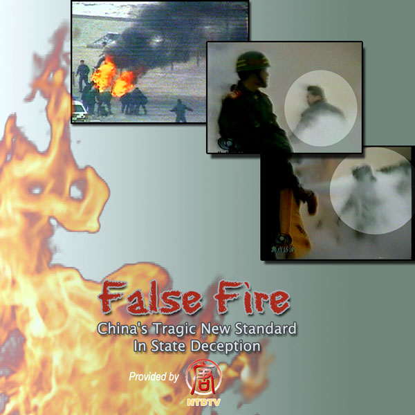</td>
</tr>
<tr>
<td align="center">获奖影片《伪火》的视频可在《获奖影片：伪火（中文版）》中下载观看。</td>
</tr>
</tbody>
</table>

为了阻止“自焚真相”的传播，江氏集团曾下令对电视插播“天安门自焚真相”的法轮功学员“杀无赦”，导致长春法轮功学员刘成军等多人被活活折磨致死。中共喉舌媒体加工的自焚录像欺骗了众多世人，获奖影片《伪火》却在海内外广泛传播，无数民众正是通过了解“自焚真相”从而明了中共迫害法轮功的真实情况。

<b>大批民众按手印　挺身声援反迫害</b>

在长达十三年的迫害中，法轮功学员不畏强权，无惧暴力，以真实对谎言、以和平对暴力、以善良对残酷，锲而不舍的向世人澄清事实，讲明真相，揭露中共编造的谎言，启发人们的善念良知，真相已大白于天下。更有无数的世人被法轮功学员们真诚、慈悲与坚定的信仰所感动，甚至加入反迫害的行列。

近年中国民众制止迫害之声也持续不绝，与迫害初期的不敢吱声迥然不同。二零一二年二月二十五日，因修炼法轮功的王晓东被非法抄家、绑架、抢劫及抓捕，河北省沧州地区泊头市富镇周官屯村全村三百户各派一名代表在呼吁书上签名，要求市检察院释放王晓东，此联合签名按手印的请愿书引起中共中央政治局的震动。

<table border="0" cellspacing="3" cellpadding="3">
<tbody>
<tr>
<td align="center"></td>
</tr>
<tr>
<td align="center">河北省泊头市富镇周官屯村三百多户村民联名按手印、加盖公章要求释放法轮功学员王晓东，撼动中共中央政治局。</td>
</tr>
</tbody>
</table>

二零一二年六月七日，河北省正定县法轮功学员李兰奎被“六一零”人员绑架到正定县看守所，再被转到石家庄市洗脑班关押迫害。中共警察肆意迫害好人的恶行，引发了正定县很多百姓的强烈不满，七百多位民众集体自发联名声援营救被绑架的李兰奎。

<table border="0" cellspacing="3" cellpadding="3">
<tbody>
<tr>
<td align="center"></td>
</tr>
<tr>
<td align="center">七百多位民众自发联名声援营救法轮功学员李兰奎</td>
</tr>
</tbody>
</table>

大规模民众联名上书这样的事件在中国越来越多，去年五月二十九日，河北唐海县五百六十二位村民按手印，支持释放法轮功学员郑祥星；黑龙江则有一万五千民众为素不相识的法轮功学员挺身而出，站出来支持当地替父鸣冤的秦荣倩，在她的《喊冤昭雪书》上签名并按上大红手印。秦荣倩的父亲秦月明，因坚持信仰法轮功而被当局关在监狱中酷刑折磨致死。

<table border="0" cellspacing="3" cellpadding="3">
<tbody>
<tr>
<td align="center">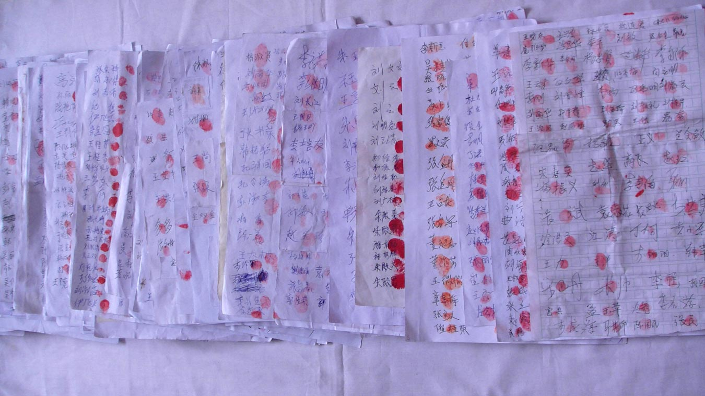</td>
</tr>
<tr>
<td align="center">黑龙江省有超过一万五千民众为素不相识的法轮功学员挺身而出，在替父鸣冤的秦荣倩的《喊冤昭雪书》上签名并按上大红手印</td>
</tr>
</tbody>
</table>

前年法轮功学员周向阳的家乡河北省秦皇岛昌黎县，约两千三百位善良民众联名支持其申诉，在当局把周向阳的妻子李珊珊抓走后，又有五百多民众联名救助。大批村民选择支持无辜受迫害的法轮功学员，是中国民众面对中共暴政，挺身选择正义的壮举，也是人心觉醒及全民反迫害的发轫。

中共炮制自焚伪案，只突显了自身的愚蠢无知。随着真相广传，人心日渐觉醒，自二零零四年十二月开始，迄今已有一亿三千多万有识之士退出了中共的党团队组织，现在正以平均每天有六万多人退党的速度逐步解体中共。曾经为虎作伥、助纣为虐的人们应该慎思明辨，早日分清正邪与善恶，为自己选择光明美好的未来。

<h1 align="center"><b>同样的烈火焚身，“待遇”为何如此不同？</b></h1>
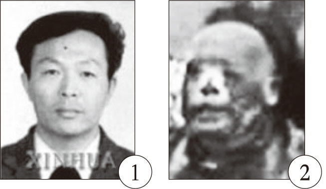 
  
文: 正信

【明慧网二零一二年七月三日】七月一日晚，一打开国际互联网，就看到报导说，六月三十日天津蓟县最大的商场莱德商厦发生火灾，滚滚浓烟笼罩全城，商厦内多人选择跳楼逃生，场面惨不忍睹。据现场附近的目击者爆料，因六月三十日正逢周六，商场顾客如潮，员工加顾客至少有上百人死亡。然而中共新华社报导称，初步确认十人死亡，十六人受轻伤，事故原因正在调查。

  
莱德商厦是座五层的老楼，其中柜台密集，空间狭小，上下层之间靠一部十二人电梯和自动扶梯联系。有知情者说：“火灾时只有商厦一层的人逃了出来，三层以上的应该很难逃生……”民众们在网上纷纷发帖怒斥说：“尸体过百，却只报告死十个。掩盖事实，目的是为县里各个领导减轻责任。他们从未为死的人想过！当官的真不是人啊，竟瞒报死伤人数！”“有关部门发假消息；有关媒体被封嘴；监管部门要逃避责任。失去亲人的人……”“我的帖子被删了四次！我愤怒至极！太敏感不能发？”“这么多人知道真相，居然还能出现这样的官方数字？！”……

其实这么多年生活在中国大陆，老百姓早已熟知了中共的恶习，但凡发生死亡、灾害事件的，一定要把伤亡人数缩小、缩小、再缩小，同时在第一次报导事件时一律称：事故原因正在调查中。把伤亡人数缩小，目的一个是所谓的维持稳定，继续保持其虚假的歌舞升平的大好形势；再一个就是把大事化小、小事化了，为日后减轻对责任人的追究做铺垫；而称“事故原因正在调查”，则能给中共一个充足的缓冲时间，以找到一个对其最有利的、最能够糊弄老百姓的借口。所以从十几年前的洛阳大火，到近年上海的“11·15”特别重大火灾，再到中央电视台配楼火灾，无一例外，隐瞒伤亡人数、火灾详情。

然而唯独有一场火，反而一反常态的在事发两小时后，反复播放，而且向全世界用英文播报了事件，中央台记者多角度、全方位的拍到，远景、近景、特点镜头一应俱全，把小事搞大，也没有称“事故原因正在调查”。那就是二零零一年一月二十三日下午发生在天安门广场上的所谓“自焚”，中共媒体在没有充份调查的情况下，一口咬定“自焚”，声称他们是“法轮功学员”。

同样是灾难、死人，为什么播报的口径、所受的“待遇”如此不同呢？理由很简单，蓟县大火也好，洛阳还是其它地方大火也好，那是因当局管治不力造成的，大厦消防设施不到位，消防安全没有保障，但在上哄下骗中，却都能消防检验合格。而“天安门自焚”的大火之所以要报，并要第一时间报，随后又是全世界、全国范围内、全方位的大报、特报、反复报，目的只有一个，那是为了抹黑法轮功，为進一步迫害制造舆论的。因为当时“江氏集团”在经过一年半的打压之后，发现不仅没把法轮功打倒，相反越来越多的人开始对这场迫害反感并转而支持法轮功：“管那帮炼功的老头、老太太干什么？让他们炼吧！”

在蓟县大火中，多位网民亲眼看到人们从三楼、四楼跳下摔死，至少有百十来人被直接送到火葬场……在这样有众目睽睽、亲眼所见为证的情况下，当局为什么依然漫天撒谎，强称只有“十人死亡，十六人受轻伤”？（也许这个数字会有所增加，但绝不会报导真实的情况。）因为强盗的逻辑是：不管你有多少人看到，你毕竟只是少数，能直接听到你说真相的，也只是当地的少部份人；而当局控制着全部的国家宣传机器，它一句谎言，就能够覆盖全国几亿观众。你当地人不信，其它更多地方的人会信，因为他们无从了解真相。再加上“谎言重复一千遍就是真理”的邪恶逻辑，它就是要这样欺骗、撒谎、强奸民意！

“天安门自焚”中又何尝不是这样呢？虽然早在“自焚”伪案发生半年后的二零零一年八月十四日，国际教育发展组织（IED）就已经在联合国会议上公开声明：“我们得到了一份该事件的录像片，并从中得出结论，该事件是由这个政府一手导演的。”当时在座的中共代表面对此景，哑口无言。而在二零零三年十一月，分析天安门自焚案的纪录片《伪火》，获第五十一届哥伦布国际电影电视节荣誉奖。在国际社会已经广泛知道“天安门自焚”“是中共一手导演的骗局”时，它为何仍然敢在国内肆无忌惮的欺骗老百姓？不也是基于同样的原因吗？国际社会再多人知道，但国内老百姓却必须得在中共的铁墙内，看中共要他们看的新闻，听中共要他们听的声音，中共不允许或不想要他们听到的声音，统统被隔绝在铁墙之外！所以说，“中国的言论自由”确切的说是“中共的言论自由”！

但是，包装再精美的谎言终究都是谎言。记的有一句话说：“谎言可以在一段时间内欺骗所有的人，也可以在所有的时间内欺骗部份的人，但却不能够在所有的时间欺骗所有的人。”事实的确如此。早在大约十年前，笔者在北京打出租车和一位的哥聊“天安门自焚”内幕时，笔者刚开个头，的哥就接到：“咱北京谁不知道天安门自焚是假的！”即使在偏僻的农村，老百姓也在口耳相传“天安门自焚是中共骗局”的真相。二零零六年，我和一堂姐讲起法轮功，堂姐说：“听说天安门自焚是假的，有一次我坐货车去城里办事，货车司机跟我讲的。他说听人讲自焚是假的，还说了很多疑点呢。”

纸包不住火。当中共的谎言被人们一个个戳穿时，就是撕去它漂亮的画皮，显现出魔鬼真面目的时候，那时它必将被正义的利剑斩碎！

<b>附：“天安门自焚”破绽分析：</b>

<b>破绽一、王进东：真身，还是替身？</b>

在“天安门自焚”案中，中共说现场打坐并喊口号的那个人是“王进东”，他是“法轮功学员”。然而从央视自焚录像的慢镜头分析看，这个人既不是“王进东”，更不是法轮功学员。

 
  
上图左边是央视自焚录像中公布的王进东的一寸标准照，高鼻梁，高眉骨，大长方耳，下颌端正。右边是在同一录像中，在现场参与“自焚”的王进东，短鼻子，塌眉骨，小圆耳，下颌粗壮。同一录像中公布的同一个人，头部照片明显差异。如果说差异是因为自焚导致的变形，那为什么在头发、眉毛都完好的情况下，骨头、耳朵会被烧变形呢？

央视自焚录像中的王进东，从盘腿、打坐的姿式到呼喊的口号，都与法轮功没有任何关系，却被中共硬栽赃为是“法轮功学员”。

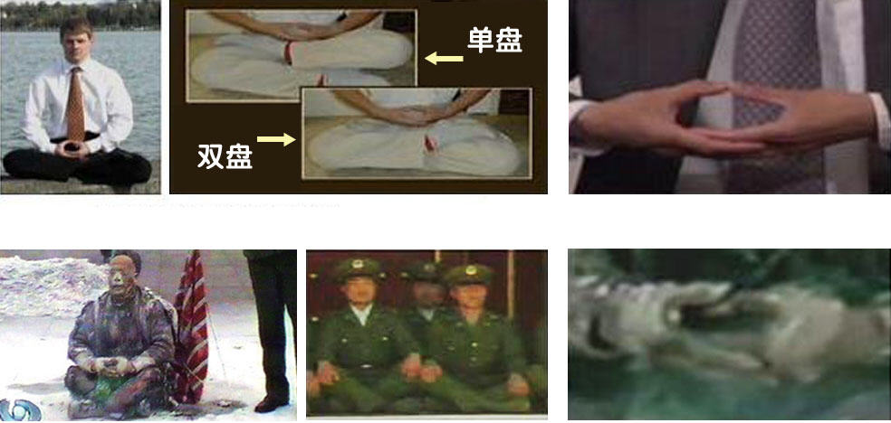 
  
法轮功要求的是双盘，至少也得是单盘，而被新华社称为自一九九七年就开始练法轮功的“老学员”王进东，散盘的双腿都翘的高高的，被外界认为是中国军人标准的坐姿。法轮功要求两手结印时，两大拇指尖正对，这是法轮功中最基本的动作，而王进东则两拇指相压。这一切都说明，他根本就没练过法轮功，也不可能是法轮功学员。

<b>破绽二、大火烧不坏的塑料汽油瓶</b>

在央视自焚录像中，看上去烧相惨重的王进东，胸部和腿部的棉衣被烧破，露出皮肉，然而夹在他被烧烂的双腿间的两只装汽油的塑料雪碧瓶，却奇迹般的颜色翠绿，且完好无损。

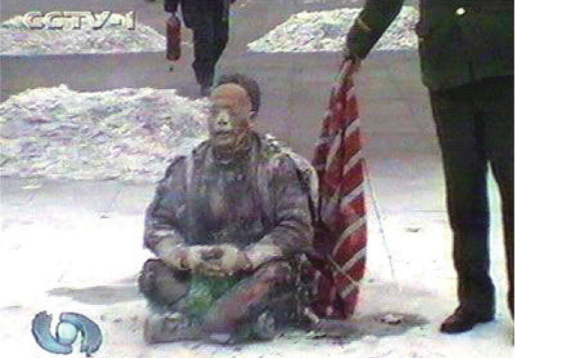 
  
任何的造假都经不起历史的检验，二零零二年，自焚案的唯一采访记者李玉强，在河北省会法制教育培训中心（中共设立的对法轮功学员非法进行洗脑的黑窝），被非法关押在那里的法轮功学员问及王进东双腿间的汽油瓶的事情，李张口结舌，不得不承认：雪碧瓶子是他们放进去的，这个镜头是“补拍”的。

<b>破绽三、刘春玲：烧死，还是打死？</b>

另一当场死亡的刘春玲，被央视说成是被“自焚”之火烧死，然而从慢镜头录像分析中，人们看到：刘春玲是在现场被人用重物活活打死的。

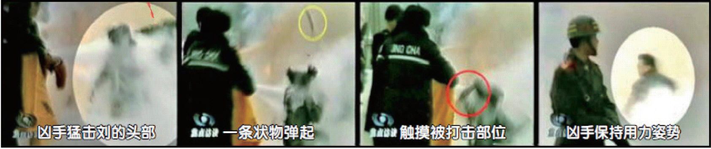 
  
<b>破绽四、刘思影：是真切气管，还是愚弄百姓？</b>

中央台的自焚录像中，积水潭医院烧伤科的副主任医生李迟说，参与自焚的几个烧伤者，都伤势严重，需要马上做气管切开手术。然而令世界医学界感到震惊的是：十二岁的小女孩刘思影，在气管切开不到四天的时间内，面对记者李玉强的采访，说话底气十足，嗓音清脆，并对全国观众唱了她最喜爱的歌曲。稍有医学常识的人都知道，气管切开手术的切口在声带的下方，做了这种手术，根本就不可能这么快正常说话，更不要说嗓音清脆的唱歌。不怪说，国际社会看到央视自焚录像后，都惊呼中共“创造了医学奇迹！”

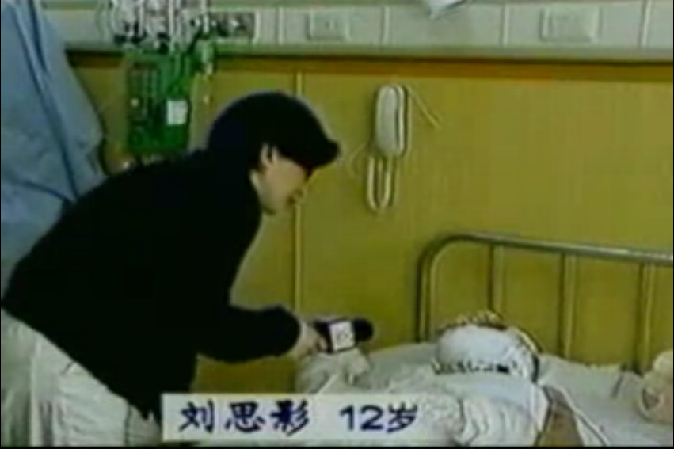 
  
<b>破绽五、央视记者在天安门等人自焚？</b>

天安门自焚录像中，远景、近景、特点镜头一应俱全，并可看到一身背摄像机者在现场慢慢的自由拍摄。通常突发事件，能够被拍到已属不易，能够被中央台记者“碰巧”的、多角度、全方位的拍到，如果没有事先的策划与准备，更是天方夜谭！

中共说，这场自焚录像是由安装在天安门广场上的监视摄像机拍摄的。如果真是这样，画面应该是远景、自上而下、角度固定的，然而央视自焚录像中，不仅可看到远景画面（如图六），还可以看到近景及面部特写画面（如图三），并可明显看出摄像机是移动、跟踪拍摄的。

当海外媒体质疑这些近距离及特写镜头是哪里来的时，中共称，是在现场的CNN记者拍到的。然而CNN国际部发言人称：他们的记者并没有拍摄到任何画面，因为在事件的一开始，他们的摄影师就被逮捕，摄影器材被没收。谎言再一次被戳穿！

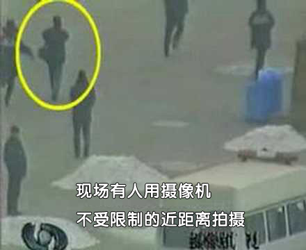 

<h1 align="center"><b>天安门不应是中共造假的戏台</b></h1>

文: 德元打印 | 转发
【明慧网二零一一年十一月二十一日】天安门是中国的象征之一。天安门始建于明朝永乐十五年（1417年），时称为承天门。清朝顺治八年（1651年）更名为天安门，取“受命于天，安邦治民”之意。此后，天安门广场上发生了许多重大的、对中国历史发展有着相当影响力的历史事件。
中共建政把天安门变成造假的戏台

中共建政在天安门，这自然是中共历史中的大事。而就连这件事情的历史记录，都得经过多次造假才能呈现给中国人，因为中共自己都无法面对历史的真相。

例如，收藏在国家博物馆的油画、所谓的《开国大典》曾四次修改，其作者董希文也因种种政治原因而饱受迫害。《开国大典》完成后才三年，就发生了“高饶事件”。作为中共副主席、政治局委员的高岗于1954年初被撤销职务，8月自杀身亡，此后又被开除出党。于是中共要求董希文修改《开国大典》，将画面上的高岗形象抹掉。

“文化大革命”开始后，刘少奇成了党内最大的“走资本主义道路的当权派”而被打倒。博物馆又通知董希文在画面上去掉刘少奇。董希文此时已得了癌症，然而他仍然抱病奉命到博物馆亲自進行修改，在刘少奇的位置上改画了董必武。

经过四次造假之后的油画《开国大典》，删去了中共6个副主席中的2个：刘少奇（用董必武代替）、高岗（用一盆花代替）。

又例如，一九八九年的六四事件，中共动用野战军，出动坦克，用达姆弹在北京市天安门广场附近及通往广场的道路沿线屠杀市民和学生，却称学生和市民们为暴乱和动乱。中共又谎说戒严部队在天安门广场执行清场任务的过程中“没有死一个人，没有轧伤一个人。”

时至今日，此事件被中共刻意淡化和掩盖，至今仍严格限制有关六四的议论。许多中国80后的年轻人不知道有此事的发生。而中共为了使其屠杀合法化，在电视媒体上对全国传递“共和国卫士”尸体被烧的枯焦，腹部被剖开，肠子部份外露的惨相。让人们以为市民和学生是“暴徒”，相信中共的屠杀是“平暴”。而在这样的惨剧中，学生、市民、军人都是中共的受害者，因为正是中共一手造成了六四事件中的军队入北京、暴力冲突和开枪屠杀，导致了学生、市民、军人的死亡。

<b>“天安门自焚”是中共再次用天安门造假</b>

而这种用焚烧人体来造假的妖魔化手法，十几年后又出现在迫害法轮功的“天安门自焚”伪案中。

“天安门自焚”是中共制造、用以栽赃陷害法轮功的恶性事件。二零零一年一月二十三日，震惊中外的“天安门自焚”案发生。中共喉舌新华社一小时后向海外发布消息，称五名法轮功学员在天安门自焚，后改口为七名。

然而，中共的喉舌“中央电视台”播出的“天安门自焚”新闻节目疑点重重，例如，天安门广场面积大而且空旷，并没有陈列灭火器，何以在“自焚者”点燃身上汽油的短时间内就有这么多灭火器 “救火”？点燃汽油短时间内就会把自身烧死，“中央电视台”并不是每天二十四小时开着多台摄影机对准广场，何以有那么多摄影机多角度地把“自焚”镜头、包括特写镜头摄制下来？现场死亡的刘春玲，电视慢镜头中清晰显示是被一个身披军大衣的人从身后击中头部而倒下的……

二零零一年八月法轮大法明慧网发布了《录像片：深入分析天安门自焚疑案(26分钟)》，揭示自焚骗局中的种种细节。同月十四日，国际教育发展组织在联合国倡导和保护人权附属委员会第五十三届会议中发表声明，指天安门自焚事件是“政府一手导演”的，并谴责中共以“国家恐怖主义行为”迫害法轮功。

<b>中共掩盖天安门前的重大历史真相</b>

在中国的历史上，天安门前不仅有中共导演的自焚伪案，也有来自全世界各地的法轮功学员冒着生命危险，在天安门广场和平请愿的壮举。而这些铭刻在历史中的一幕幕，却是中共想方设法封锁，不想让中国人了解的。其中部份法轮功学员在天安门上访后，被中共动用国家机器和军队活摘器官致死，这重大的历史真相，正随着中共退出历史舞台被一步步的揭示给世人。

<table border="0" cellspacing="3" cellpadding="3">
<tbody>
<tr>
<td align="center">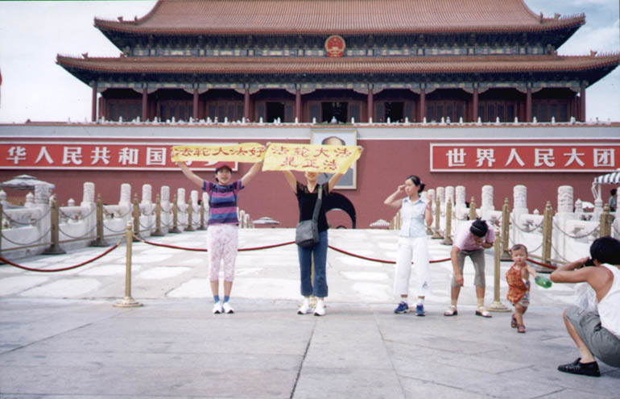</td>
</tr>
<tr>
<td align="center">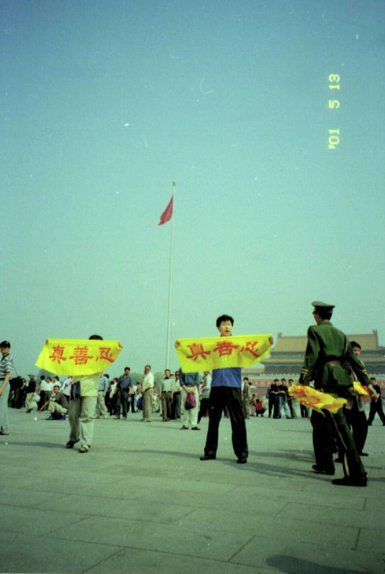</td>
</tr>  
<tr>
<td align="center">天安门前和平上访的法轮功学员</td>
</tr>
</tbody>
</table>

加拿大法轮功学员泽农曾写下《我为什么去天安门广场》一文，文中说：“法轮大法来自于你们的家乡──中国，来自你们那博大精深而又美好的文化。没有大法，就没有今天的我。就是带着这份深深的敬意，我踏上了你们的国土，为你们而来，向你们讲清真相。我希望通过我这张西方的面孔和纯净的心，能够唤醒你们心中的善念。请不要追随江泽民及其帮凶迫害法轮功，因为这会使你们陷入灾难。我不反对中国政府，也不反对中国。实际上，自从修炼法轮功以来，我已对中国文化和中国人民有了更深的理解。这也是我觉得我必须去中国的原因。”

“……宇宙大法在当今这样的乱世中传到了这个世界，而法轮大法学员不顾一切风险将真相传递给你们。他们将成为未来的英雄，将永远被记载于未来的中国文化和世界史册之中。亲爱的朋友，我跨越千山万水来到这里，就是想告诉你：你也同样希望在历史中作为正的生命被后人记住。你也一定听说过‘善有善报，恶有恶报’的道理，不要忘记，你的未来亦遵循这样的法则。”

<table border="0" cellspacing="3" cellpadding="3">
<tbody>
<tr>
<td align="center">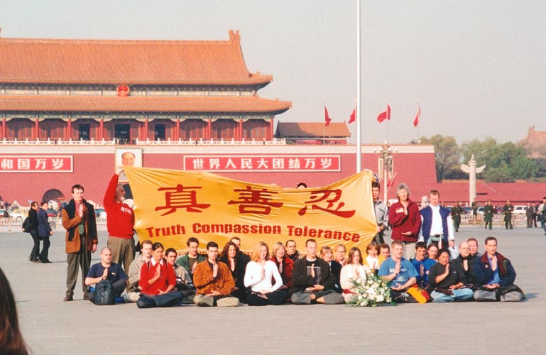</td>
</tr>
<tr>
<td align="center">三十六名西人法轮功学员去北京天安门证实大法、抗议迫害</td>
</tr>
</tbody>
</table>

十年前和三十六名西人法轮功学员去北京天安门证实大法、抗议迫害的德国法轮功学员玛丽昂回忆道，即使对他们这些西方人，警察都会进行威胁、甚至是动手打人，他们如何对待去天安门上访的中国法轮功学员就可想而知了。他们非常害怕让别人看到我们，如果他们做得对，他们为什么这么害怕呢？这不正说明他们知道自己做的事情见不得人吗？

玛丽昂对中国人讲出了自己的心声：“为了中国人，我去了天安门，我最想对中国人说的就是：法轮大法是中国正统文化的一部份，是一条正道，是全人类的财富。”
