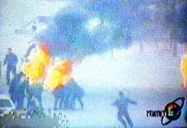

<h1 align="center"><b>明慧专题：“天安门自焚”真相</b></h1>

2001年1月23日（除夕）下午，天安门广场“突发”5 人自焚事件。 事发仅 2 小时，新华社以超乎寻常的速度向全世界发出英语新闻，声称“自焚者是五名法轮功学员”。但是，美国之音记者打电话向北京公安局和公安部查证，答复竟然是不知道有这回事。喉舌的宣传口径竟然抢到了公安调查的前面！

如此迫不及待，已经暴露了这并非突发事件，而是一场准备充分的阴谋——假如真是突发事件，是根本来不及准备的。

当局的准备不仅仅是这些，央视紧跟着推出了攻击法轮功的“自焚新闻”、“焦点访谈”，而且强制全国各界、各企事业单位观看，反复“学习”。然而事与愿违的是， 反复播放的录像却暴露了越来越多的破绽，显出这是一场骗局。

<h1><b>法轮功明确指出：</b></h1>
<h2><b>炼功人不能杀生，自杀有罪</b></h2>
法轮修炼大法是由李洪志先生创编的佛家上乘修炼大法。在李洪志大师的著作《转法轮》中明确指出：“炼功人不能杀生”，李洪志先生还在 《悉尼法会讲法》中指出：“自杀是有罪的。” 真正的法轮功学员不会去自焚。

<b>自焚伪案疑点：</b> 
<b>女主角被当场灭口？</b>

<h1 align="center"><b><a href="https://github.com/mbzxdj/san/blob/master/download/jxgs.mp4?raw=true">录像：追查国际“天安门自焚疑案”调查纪实</a></b></h1>

“追查迫害法轮功国际组织”成立于二零零三年一月，是以追查取证和国际起诉迫害法轮功相关人员为重点的独立常设国际机构。本组织的使命是：追查迫害法轮功的一切罪行以及相关的机构、组织和个人。无论天涯海角，无论时日长短，必将追查到底；行天理，再现公道，匡扶人间正义。

2001年1月23日下午2点41分，北京天安门广场发生了震惊中外的“自焚”事件，中国官方新华社和中央电视台第一时间迅速报道，指称参与”自焚”的五人和两名“自焚未遂者”为法轮功学员。法轮功学员否认了指控，并指出“自焚”行为严重违反法轮功的原则和教导。一些国际媒体和第三方国际机构也提出质疑。美国<华盛顿邮报>记者的实地采访证实，“自焚”者并非法轮功学员，而国际教育发展组织所提供的“自焚”现场录像分析更指出，中国政府涉嫌一手策划导演了这场“天安门自焚”事件。事实真相究竟如何？

鉴于此案性质严重，影响巨大，本组织在得到有关“自焚”疑案的多方举报后，特于2003年1月23日成立“天安门自焚事件调查委员会”，对此案进行了多方位深入详细的取证调查。

[大字片头]“天安门自焚”疑案调查纪实

（一）对王进东和刘葆荣的语音鉴定

在“天安门自焚”事件中，有个多次出场的重要人物：王进东。我们来看看这位被中国政府称为“自焚”事件的组织者王进东。

[“自焚”录像中王进东的镜头，央电视台的三集《焦点访谈》节目中的王进东]

这就是王进东。我们接到多起举报指证，在“自焚”现场的王进东与《焦点访谈》节目中的王进东不是同一个人。

追查迫害法轮功国际组织根据举报，对王进东进行了多角度的追查取证。首先我们委托世界先进的中文语音识别实验室对前后出场的王进东作了语音鉴定。音像资料取中国自央电视台的《焦点访谈》节目。

台湾大学语音实验室在中文语音的辨识、合成、检索、验证、及口语对话等方面拥有相当丰富而先进的技术，曾率先完成全世界第一台能相当正确辨识任意文句的中文语音的电脑。

[采访台大语音实验室语音鉴定专家]
承追查国际所委托，对于王进东的语音鉴定，我们采取了先进的“语者验证（Speaker Verification）”技术，将常用于语者验证高斯混合模型（Gaussian Mixture Model，GMM）用于对王进东等前后出现的语音进行比较鉴定，……

[语者验证结果报告分析，图表，仪器显示等。专家叙述]
从这些语者验证结果报告中，可以得出十分确定的结论：积水潭医院中被烧伤（或第一集中被烧伤）的王进东与其他两集《焦点访谈》节目中的王进东不是同一个人。

台大语音实验室：语者验证结果报告。

[王进东前后出场镜头特写，定格，大字字幕]
两个“王进东”！

[王进东“自焚”现场打坐镜头，旁白]
此鉴定结果与本组织通过其他渠道对王进东真实身份的追查结果相吻合。追查国际从可靠途径查获：参与“自焚”的“王进东”是由一名现役军人扮演。

（二）对刘思影的死因调查
“自焚”事件中，有一个叫刘思影的小女孩被严重烧伤。

事发后，刘思影和其他几位伤者被送往据称是北京治疗烧伤最好的积水潭医院。追查国际对积水潭医院参与治疗刘思影的医务人员进行了调查。

经过详细调查，我们从积水潭医院参与治疗刘思影的医务人员处得到惊人消息：

“刘思影在烧伤基本治疗得差不多了，身体已基本恢复正常，已打算出院的时候突然死亡，死因可疑。”

刘思影死前一段时间，包括死亡前一天，3月16日，周末休息前的星期五，心肌酶谱和其他各项检查均正常。然而3月17日，星期六的中午11-12点左右医生突然发现刘思影已处于病危状态，并很快死亡。另3月17日上午8-9点钟时，积水潭医院负责人和北京市医政处处长曾到刘思影病房探视，与刘思影说了很多话。

谁谋杀了刘思影！？

（三）失踪的两个多小时

[“自焚”现场录像，部分原声报道]

据新华社2001年1月30日对自焚事件的报导称，1月23日14时41分，在人民英雄纪念碑的东北侧，王进东首先点燃火焰，“不到一分钟，几名民警连用４个灭火器，迅速扑灭了这名男子身上的火焰，并用值勤警务车将其迅速送往医院救治。”几分钟后，人民英雄纪念碑北面，４名相距不远的女子点燃了身上的汽油。仅过了一分半钟，火焰均被扑灭。“事件发生后不到７分钟，北京急救中心的三辆急救车也及时赶到现场，将伤者紧急送往北京治疗烧伤最好的积水潭医院。”

从新华社报导的“自焚”开始的时间下午2点41分加上7分钟的灭火、送上救护车的时间和从天安门广场到积水潭医院20多分钟的正常车程（对急救车行驶应短于此时间），这些“自焚”人员应该在下午3点多被送到积水潭医院。

根据调查，积水潭医院多位工作人员确认，“自焚”者至少在晚上5点以后才被送到积水潭医院。那么，从下午3点左右到晚上5点左右，中间至少有两个小时以上的时间，新华社的报导无法解释这些人去了哪里？原本20多分钟的车程为什么花了急救车两个多小时？

在这失踪的两个多小时里到底发生了什么？

（四）对刘春玲的死因调查

[刘春玲被击打镜头]
从中央电视台《焦点访谈》节目中关于自焚的现场录像可以看到，有一名身穿大衣的男子手持一重物，用力向死者刘春玲的头部击打，导致刘春玲急速倒地，并用手护卫被打的左侧头部。追查国际有理由认为刘春玲极有可能是在现场被打死，而非被烧死。现场这一名身穿军大衣的男子很明显不是在参与救人，而是要置刘春玲于死地！

[定格穿军大衣的男子]
这个人是谁？他为什么要谋杀刘春玲？

根据以上的调查结果和证据，本组织确认“天安门自焚”事件是中共建政以来的一桩极大的阴谋，涉及恶性谋杀和栽赃陷害。该案牵扯的各方关系复杂，犯罪元凶可能直接涉及到中国原国家主席、原党总书记和当时和现在都是军委主席的江泽民。追查国际将继续深入地追查此案，公布事实真相，并将调查结果报告相关国际机构和各国司法及人权机构，进行法律起诉，直至将所有犯罪者和阴谋策划者绳之于法。

策划“天安门自焚事件”的嫌犯和主谋

身穿军大衣、拿重物击打刘春玲的凶犯

谋杀了刘思影的嫌犯

追查迫害法轮功国际组织
“天安门自焚”事件调查委员会

2003年5月2日
<h1 align="center"><b>◎天安门警察背着灭火器巡逻？</b></h1>
<table border="0" cellspacing="3" cellpadding="3">
<tbody>
<tr>
<td align="center"></td>
</tr>
<tr>
<td align="center">澳洲《时代报》（The Age）2004年10月16日的报道对央视的自焚录像做出强烈质疑：“警方事先不知情，却在90秒内，携带大量消防设备出现在画面中。”</td>
</tr>
</tbody>
</table>

<h1 align="center"><b>◎衣服烧烂，头发却耐火？</b></h1>

<table border="0" cellspacing="3" cellpadding="3">
<tbody>
<tr>
<td align="center"></td>
</tr>
<tr>
<td align="center">警察晃着灭火毯等镜头，棉衣裤子烧烂，头发还完好，火烧后盛着汽油的塑料瓶完好翠绿。央视女记者承认自焚“摆拍”。</td>
</tr>
</tbody>
</table>

<h1 align="center"><b>◎谁是画面外的摄影师？</b></h1>

<table border="0" cellspacing="3" cellpadding="3">
<tbody>
<tr>
<td align="center"></td>
</tr>
<tr>
<td align="center">图中的男子在军警间从容拍摄。国际社会质疑：央视自焚录像有远景、移动拍摄的近景，还有多个自焚者在不同位置的特写，并且录下了声音，显然摄影师做好了准备才能做到的专业拍摄。</td>
</tr>
</tbody>
</table>

<h1 align="center"><b>◎自焚的王进东是法轮功学员吗？</b></h1>
<table border="0" cellspacing="3" cellpadding="3">
<tbody>
<tr>
<td align="center"></td>
</tr>
<tr>
<td align="center">自称“老学员”的王进东竟然不会双盘腿。</td>
</tr>
</tbody>
</table>

<table border="0" cellspacing="3" cellpadding="3">
<tbody>
<tr>
<td align="center"></td>
</tr>
<tr>
<td align="center">王进东的大拇指不是法轮功的正确动作——指尖轻轻接触，而是错误的上下重叠。</td>
</tr>
</tbody>
</table>

<h1 align="center"><b>国际教育发展组织：该事件是由政府一手导演的</b></h1>

<b>2001年8月14日，在联合国倡导和保护人权附属委员会第53届会议上，天安门自焚案被当场揭穿。国际教育发展组织（IED）发言说：“我们的调查表明，真正残害生命的恰恰是中共当局……我们得到了一份该事件（天安门自焚案）的录像片，并从中得出结论，该事件是由这个政府一手导演的。”面对确凿证据，中共代表团哑口无言，没有辩辞。该声明已被联合国备案。 </b>

<h1 align="center"><b>联合国会议大厅里，正义的声音再次响起</b></h1>

文/法轮功学员日内瓦报导

【明慧网2001年8月18日】继八月三日发言谴责中共当局对法轮功的迫害及人权侵犯之后(见明慧八月十四日报导)，国际教育发展组织(International Educational Development, IED)八月十四日在联合国倡导和保护人权附属委员会(The United Nations Sub-Commission on the Promotion and Protection of Human Rights)第53届会议第六项议程中再次发言，强烈谴责中共当局的“国家恐怖主义行为”。

IED八月十四日的声明中说：“政府对人民施行的国家恐怖行为所导致的严重人权迫害远远超过任何其他形式的恐怖主义行动。当一个政权施行国家恐怖行为时，国际社会就将面临大量人权侵犯案例和难民而不知所措的困境。中国对法轮功修炼者的残暴迫害就是这样的例子。”

“我们在八月三日的发言中描述了我们对法轮功的观察了解。中国政府代表在随后的答复中企图以诬陷法轮功残害生命破坏家庭来为其国家恐怖行为辩护。我们的调查表明，真正残害生命的恰恰是中共当局。是中共当局对法轮功修炼者的虐杀而导致家庭破裂。伤害生命的不是法轮功，而是极端残暴的酷刑、精神病院里的摧残、劳改营的奴役、以及其他类似的迫害。正如‘国际先驱导报’八月六日报导，连中国政府都承认施行酷刑折磨以消灭法轮功的政策。中共当局并企图以今年一月二十三日天安门广场上的自焚事件为证据来诬陷法轮功。然而，我们得到一份自焚事件的录像分析却表明，整个事件是由政府一手导演的。我们现有该录像的拷贝，有兴趣者可来领取。”

“联合国‘关于酷刑折磨’的特派专员在他最新的年度报告中指证了中共当局对成千上万法轮功修炼者的拘捕和折磨。联合国‘关于非法、任意或集体屠杀’的特派专员，‘关于对妇女暴力’的特派专员也做出了类似的指证。我们正在整理的证据表明至少有五万名法轮功修炼者被关押在监狱、劳改营、或精神病院里，至少数千人遭受殴打并有很多人被折磨致死。几十万上百万人的安全受到严重的威胁。联合国的人权机制明显已经无法处理如此大量的人权侵犯案例，国际社会也将很难容纳如此多的难民。因此，联合国‘保护人权附属委员会’以及整个国际社会应当紧急干预中共当局的国家恐怖主义行为”

IED的发言再次引起轰动， 许多人前来索取声明的文本和自焚真相的录像。IED的这个声明也再次进入联合国官方的记录。

中国代表团在八月三日曾对IED的指控加以面对抵赖。这一次，面对凛然的正义之声和确凿的证据，中国代表团噤声不得，连抵赖的机会都放弃了。

与此同时，与会的欧洲美洲法轮功学员奔走在联合国人权高级委员会威尔逊宫，向联合国各种人权机构递送大陆法轮功学员传递出来的各种迫害案件，引起了十几个特派专员办公室的重视。这方面的情况我们将陆续加以报导。

国际教育发展组织八月十四日的声明的原文见： 
http://www.clearwisdom.net/emh/articles/2001/9/9/13711.html

<h1 align="center"><b>法轮功禁止杀生和自杀</b></h1>

 
  
【明慧网二零一四年一月七日】（明慧评论员文章）<b>法轮功是上乘佛家修炼大法，明文禁止杀生和自杀。任何以自杀、杀生行为诬陷、诋毁法轮功的人，都不敢让人系统地、不带任何观念地、静心地阅读法轮功原著，特别是《转法轮》一书，也不敢让人亲身体验法轮功的功法，因为坏人也知道：很多人都是有良知的，看见真相就不愿再相信谎言。</b>

为了各位的前程，希望大家都来看《是自焚还是骗局》这个十三分钟的录像短片，即便是在百忙之中，很值得看，不看以后可能会非常遗憾！如果能静心通读《转法轮》一书，就更好。

中共就是中共，本性绝不会改变，就如同狼绝不会变成狗或者羊。十三年前的“天安门自焚”骗局虽然早已被揭穿，但命令烧书、禁书的那些中共罪人，总是在寻找欺骗更多人的机会，想多拉一些人陪绑，其中包括海外出于各种目的想和中共走近的人，并借此延缓中共被治罪的那一天的到来。

历史上对正信的迫害从来就没有成功过，现在中共对法轮功“真善忍”真理的迫害更是从一开始就注定了失败。从1999年7月至2014年1月，这场对法轮功的政治迫害已持续十五年了，法轮功学员在中国大陆和平、理性的反迫害言行，通过海外明慧网对迫害黑幕的揭露，也持续十五年了，迫害行为赖以藏身的主要场所——劳教所已经解体，迫害走入末路之末。在这种情况下，又有人到海外拿自焚骗局作招牌，象开假面舞会似的演戏，这一次，目的是骗谁呢？

自焚真相是本世纪重大信息。知道才能心明眼亮，明白才有未来、有光明、有希望。

<b>相关历史概要：</b>

1）法轮功是佛家上乘修炼大法，以《转法轮》一书教人按“真善忍”做好人、提高道德境界，并辅以五套动作优美缓慢的功法。从1992年5月公开传出，至1999年7月，短短七年间，学炼法轮功的人数已高达一亿；因祛病健身、回升社会道德的显著功效，法轮功在中国的声誉家喻户晓。

2）1999年6月，中共专门为迫害法轮功而成立了权力凌驾于公检法之上的“610办公室”。

3）1999年7月，中共首恶江泽民、罗干出于妒嫉和个人利益，发动了对法轮功的全面迫害。但当时，中国大陆有太多的人都经历过“文化大革命”，也都知道法轮功的功效，所以对这场政治迫害不以为然，对政府发动的“百万签名声讨法轮功”等活动消极对待。同时，大批法轮功学员自发地走向北京信访办、天安门广场，为法轮功说公道话。

4）江泽民发布的密令中，最臭名昭著的是对法轮功“名誉上搞臭，经济上截断，肉体上消灭”、“往死里打，打死算自杀”、“打死不查身源，直接火化”。

5）为维持和广泛推动这场迫害法轮功运动，2001年1月23日，江泽民、罗干之流，在天安门广场推出了一场自导自演的自焚事件，并动用全中国的媒体，用这场伤天害理、残害生命的黑戏，嫁祸法轮功。

6）“天安门自焚”骗局推出一周后，人们疑问重重。于是中共操控中央电视台，推出了一个以自焚为题的“焦点访谈”节目，攻击法轮功。然而通过对“焦点访谈”的录像进行慢镜头播放和分析，人们却发现了更多的漏洞。比如，在这场事件中当场失去性命的刘春玲，不象被焚烧致死，而是被突然来自脑后的重物击打致死，而神秘的击打者是军警模样。中央电视台的自焚画面中还有王进东的现场大特写，一名警察站在他的身边，拿着灭火毯，悠闲地等着王进东喊口号，然后机械地把灭火毯盖在王的头上。“王进东”浑身衣服被烧得七零八落，可是他两腿中间装汽油的绿色塑料雪碧瓶却完好无损。

7）法轮功是佛法修炼，禁止杀生和自杀。1995年出版的法轮功主要著作《转法轮》〈第七讲〉中专门有“杀生问题”一节，其中写道：“杀生这个问题很敏感，对炼功人来说，我们要求也比较严格，炼功人不能杀生。”1996年法轮功创始人李洪志先生在《悉尼法会讲法》时，当有弟子问，“杀生是一种很大的罪业，一个人他自杀算不算罪呢？”李先生回答：“算罪。……所以自杀是有罪的。”

8）尽管江罗监制的自焚事件漏洞百出，但想在政治上捞票的人，常年将此伪案和骗人用的“标准答案”塞入中国大陆中小学校的教科书、考试题、招工表格，从儿童、青少年学生做起，制造对法轮功的恐惧和仇恨。 

<h1 align="center"><b>华盛顿邮报做出历史证言：自焚的火焰照亮了中国的黑幕</b></h1>

 
<b>在自焚事件两周后，华盛顿邮报记者菲力普•潘发表《Human Fire Ignites Chinese Mystery》（自焚的火焰点燃中国的黑幕）的调查报道，该记者到自焚者之一的刘春玲的居住地开封市采访，刘的邻居告诉记者：“没有人曾看到过她炼法轮功。”</b>
 
  
作者：菲力普.P.潘（Philip P. Pan）

【明慧网编注：2001年1月23日（农历除夕）天安门自焚事件发生之后，中共新华社一反层层请示、迟迟不报的常态，在有关公安部门值班人员尚不知晓的情况下，以惊人速度报道了自焚事件，并一口咬定此事乃法轮功所为。随即，法轮功纽约信息中心于美东时间1月23日上午通过本网站发表了题为“中共制造自焚惨案，新华社造谣陷害法轮功”的声明，稍后又通过国际媒体向中共和世界发出呼吁，呼吁尽快进行第三方独立调查。一周之后，中共掌控的中央电视台抛出自焚死亡女子刘春玲之女、12岁的小学生刘思影被焚烧后的悲惨画面，在加紧开展强征签名、大面积逮捕等一系列迫害行动的同时，公开煽动公众对法轮功的仇恨，挑动群众斗群众。
2001年2月4日，华盛顿邮报在头版发表题为“自焚的火焰照亮了中国的黑幕——当众自焚的动机乃为加强对法轮功的斗争”的惊世调查文章，向世界提供了包括以下几点在内的事实：

◆刘春玲不是开封本地人，生前在夜总会靠陪吃陪舞谋生； 
◆刘春玲曾不时殴打老母和幼女； 
◆从来没人见到刘春玲练过法轮功。

下面是上述华盛顿邮报调查文章的中译稿：】

华盛顿邮报：自焚的火焰照亮了中国的黑幕
——当众自焚的动机乃为加强对法轮功的斗争
图片说明：五名据新华社称是法轮功的成员于1月23日在天安门广场自焚；1月30日的中国国家电视中播放了该镜头。(路透社)

2001年2月4日星期日，华盛顿邮报海外报道，A01页：

中国开封消息：在这个曾经繁华的城市的东边有一个地方叫做苹果园，但这里已经没有了苹果树，而只有单调的混凝土建筑和成群失业的人在泥泞的街上闲逛。刘春玲(音译)和她12岁女儿，刘思影(音译)就住在这儿，六号楼四层的一个公寓里。

母亲是一个平静而内向的女人；女儿是一个活泼的五年级学生，从不忘记微笑并和别人打招呼。邻居们回忆了刘春玲奇怪而悲伤的遭遇：她有时打孩子，她曾把她年迈的母亲赶走，她在一家夜总会工作，靠陪伴男人挣钱。

但是没有人认为36岁的刘春玲可能会加入被禁精神运动法轮功。并且，没有人注意到她和她的女儿是何时失踪的。

接下来，他们上了国家的电视，她们的身体在天安门广场上被桔红色的火焰吞没。刘思影躺在担架上出现在镜头中，她的脸和唇呈焦黑色，呜咽着：“妈妈！妈妈！”而她的妈妈，据新闻报道说，已经死了。

开封市位于河南省中部，在北京以南350公里之外。是什么原因促使刘氏母女以及另外三个来自开封的人在1月23日，即中国的除夕，向他们自己的身体浇上汽油而点火自焚呢？一场进行中的激烈斗争正在回答这个问题。五名被选派者轮流上镜，作为邪教牺牲品，或者反对政府镇压的正直的抗议者，或者生活在快速变化的社会的边缘而被绝望地疏远了的人们。

执政的共产党发起了一场倾尽全力的运动，利用该事件来证明他们将法轮功宣布为危险的X教的正确，以将中国和海外公众的意见扭转为反对这个18个月前遭到中共取缔的团体。中共一直不遗余力地镇压这个团体，并不时对其使用暴力战术。

每天从早到晚，国家掌控的媒体都要对法轮功及其在美国的创始人李洪志发动新的攻击。学校被命令对学生进行有关该教派的“教育”；工厂、办公室和大学组织里要组织讨论和会议；远在西藏的宗教领导人也发表按演讲稿准备的谴责声明。在开封，邮电局发行了反法轮功的首日封……

中国还利用该事件向香港施加压力以取缔法轮功，这是对这个前英国殖民地对本地事务有自治权的“一国两制”的一个检验。法轮功在香港合法存在，但是保安局局长在星期四警告说警察准备密切监视该团体的活动。法轮功领导人坚持说刘氏母女以及她们的同伙应该不是法轮功学员。法轮功是一种综合了佛家，道家思想和中国传统气功的功法。他们说，法轮功明确禁止暴力和自杀，并暗示说中国政府导演了这一事件。

另一些人权活动家说这五名自焚者是为了抗议政府对法轮功的镇压，因为该镇压导致了数千人被捕，以及105人被残杀在拘留所。

在中国有出于政治动机而自杀的传统。中国上一个王朝开始的时候，是1640年，数百人宁可自杀也不生活在满洲人的统治下。大约250多年前，数名学生自杀以抗议清朝拒绝建立共和宪政。不久之前，有无数中国人放弃生命以逃避毛泽东在文化大革命中对人权的肆意践踏。

但是当众自焚却是史无前例的。在开封，这个拥有70万人口的前帝王首都，一个千年之交的世界上人口最密集的城市，大多数居民对刘和其他人的行为认识模糊。

“他们使开封蒙羞，他们是中国在世界面前蒙羞。太过分了！”汤绍华（音译），这个在刘家附近卖蔬菜的60岁的人说。

“我不是说我不相信政府，但是我也不是说我相信它，”刘晓宇（音译），39岁，她一边在开封夜市包饺子一边说。“政府控制了新闻。我们现在都知道这一点。”

出租车司机王朝辉（音译）说他认为法轮功象其他的宗教，并说谴责这个拥有数百万修炼者的团体中的5个人的行为是不公平的。无论如何，他说，对法轮功的镇压肯定要平反。

“中国现在不一样了，他们不能把所有有这种信仰的人都抓起来，”他说，“这只会把事情搞糟。”

王说中国必须面对的真正问题是为什么如此多的人信仰法轮功。“人们对社会不满，”他说。“这才是问题所在。”

象中国的其他地区一样，开封在共产主义意识形态失去吸引力后经历了各种宗教的回潮。在过去10年，大量的居民皈依基督教，佛教，道教，以及法轮功。在该团体被禁以前，有数百人在城市的公园里打坐炼功。法轮功吸引了中国各个领域的人，－－共产党员，高级军官，政府官员，教师，以及数百万生活在社会边缘的人。在开封，这个一些工厂关闭，经济衰退的城市，许多人寻求精神信仰。国家媒体对这五个自焚者为什么加入法轮功只字未提。刘思影和另外三名幸存者都因严重烧伤而住院，北京则拒绝所有对他们的探视请求。一个开封官员说，只有中国中央电视台以及官方的新华社可以与他们的亲人及同事交谈。刘家的一个来开门的男子将一切提问都推给政府。

但刘春玲在苹果园的邻居将她描述为一个生活波折并遭受心理问题折磨的女人。国家媒体说78岁的郝秀珍（音译）是她的养母。邻居说在刘去年将郝秀珍赶出家门前，她们母女经常吵架。

“她有毛病，”邻居刘敏（音译），51岁，说。“她打她母亲，她母亲就又哭又喊。她也打她女儿。”

对于刘如何养活自己，以及女儿父亲的去向也有许多问题。邻居说，刘不是开封本地人，南方广东省的一个男人为她付房租。另一些人，包括22岁的邻居魏剑（音译），说刘在当地的一个夜总会工作，她靠陪吃陪舞赚取报酬。

从来没有人见她练过法轮功。

（明慧网编译 2001年2月4日） 

<h1 align="center"><b>法新社：中国禁止烧伤者被家人探视</b></h1>

AFP：China Forbids Families of Burned Falun Gong Members From Seeing Them

【明慧网2001年2月13日】 译者注：2001年1月23日，在北京天安门广场发生5人自焚事件，法轮功方面明确表示，由于法轮功禁止杀生和自杀，并且伤者行为及言论不符合法轮功的教导，因此认为他们并非法轮功弟子。中共方面借此机会诽谤，抹黑法轮功，一口咬定5人为法轮功学员。目前法轮功方面正呼吁第三方独立调查。以下是法新社的一篇报道。

 
法新社2001年2月9日报导 --

法新社北京2001年2月9日消息：中国禁止五名在天安门广场自焚人员的家属去医院探视他们，伤者中包括一个12岁的女孩，他们都仍生命垂危。

刘思影的奶奶星期五从她河南省中部的家中通过电话告诉法新社，这个女孩的所有亲属都被禁止去北京探视她。“当局说谁也不能见她，”这位老大妈不安地说。“他们命令我不得接受任何采访…我只能说这些。我必须撂电话了，再见。”

除了诸如新华社这样的政府喉舌可以进入医院会见伤者，政府拒绝了所有的外国和国内记者采访伤者的要求。

负责救治伤者的北京积水潭医院的一个官员确认说，“610办公室”，这个负责调查法轮功活动的机构，禁止伤者家属以及记者的探访。该官员说，“家属都没来探视。他们必须经过610办公室的批准，但610办公室不会批准的。”

同时，警察将刘家里里外外翻了三遍，以寻找证据，另一个亲属告诉法新社。“他们拿走了一些材料。我们不知道他们拿走了什么，但是刘思影的奶奶都80多岁了，所有这些对她的压力太大了。”“我担心她受不了了，”该亲戚说。
